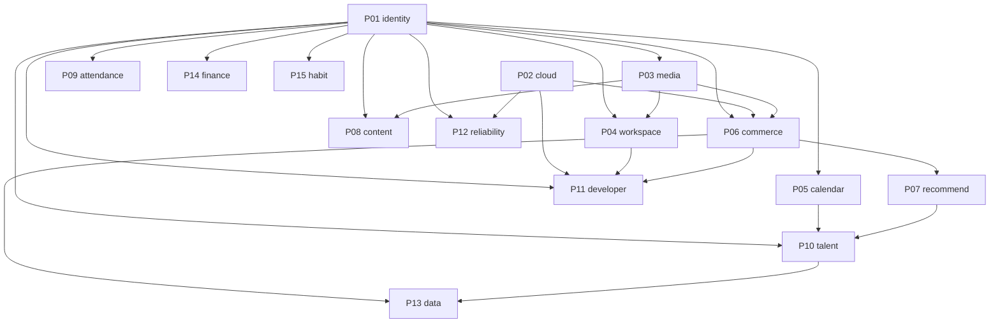

# ポートフォリオ実装マスタープラン

この資料は、30 個のアイデアを **15 プロジェクト** に統合したあとの全体方針です。個別プロジェクトを実装するチャットでは、本ファイルと対象プロジェクトの `DESIGN.md`、対応する `portfolio-idea/*.md` をコンテキストに渡してください。

## 結論

- **統合後のプロジェクト数: 15**
- **元アイデア数: 30（欠落なし）**
- **同時に本線として走らせる開発トラック: 最大 3**（基盤が揃ったあと）
- 認証・ファイル・画像・観測・予約は「製品をまたぐ共有能力」として切り出し、同じ機能を 30 回実装しない
- フロント / バックエンド / インフラのライフサイクルが独立するものでも、**一人開発では製品ごとに 1 Git リポジトリ**（中は `apps/` 分割）にする。入れ子 Git は使わない。

就職活動上の見せ方は「15 個のバラバラな習作」ではなく、**1 つのポートフォリオ・エコシステム**である。ただし各プロジェクトは単独デモ可能で、他プロジェクトが落ちていても IdP モックやシードデータで動くことを必須とする。

**ローカルデモは 2 モード。** 各 `pf-*/deploy/compose.yaml` の **単体デモ**（必須）と、Docker Desktop Kubernetes + `pf-cloud-k8s` の **連携デモ**（任意・横断確認用）。手順の正本は `portfolio-plan/integration-demo.md`。全 Pxx を 1 台で同時フル起動するのは非目標。

## プロジェクト内訳

| ID | プロジェクト | 含める元アイデア | リポジトリ方針 | 役割 |
| --- | --- | --- | --- | --- |
| P01 | identity-platform | 14 | 製品モノレポ `../pf-identity` | 全アプリ共通の OIDC IdP |
| P02 | cloud-platform | 16, 17, 18 | ポリレポ（`pf-cloud-o11y`, `pf-cloud-k8s`, `pf-cloud-aws`） | AWS 3-tier、K8s、可観測性。連携デモは `pf-cloud-k8s` |
| P03 | media-platform | 13, 28 | ポリレポ | ファイルストレージ + 画像派生パイプライン |
| P04 | workspace | 01, 02, 12, 26 | ポリレポ | カンバン + Wiki + チャット + 共同編集 |
| P05 | calendar | 11 | モノレポ | 予約・日程調整（他製品が利用する共有能力） |
| P06 | commerce-platform | 05, 06, 24, 25 | ポリレポ | EC マイクロサービス、在庫ダッシュボード、GraphQL BFF、イベントソーシング注文 |
| P07 | recommend | 20 | モノレポ | 推薦の学習と推論。commerce と talent が利用 |
| P08 | content-platform | 07, 09 | ポリレポ | 技術ブログ CMS + URL 短縮 |
| P09 | attendance | 03 | モノレポ | 勤怠・工数（業務システム枠） |
| P10 | talent-platform | 27 | ポリレポ | 求人マッチング。calendar / recommend を利用 |
| P11 | developer-platform | 08, 15, 21, 23, 29 | ポリレポ | CLI、OpenAPI ポータル、脆弱性診断、CI 可視化、コードレビュー |
| P12 | reliability-platform | 04, 30 | モノレポ | インシデント管理 + ランブック訓練 |
| P13 | data-platform | 19 | モノレポ | ETL。後から commerce / talent をソースにする |
| P14 | personal-finance | 10 | モノレポ | 家計簿 PWA |
| P15 | habit-tracker | 22 | ポリレポ | モバイル習慣トラッカー |

### アイデア → プロジェクト逆引き

| アイデア | プロジェクト |
| --- | --- |
| 01 カンバン | P04 workspace |
| 02 Wiki | P04 workspace |
| 03 勤怠 | P09 attendance |
| 04 インシデント | P12 reliability-platform |
| 05 EC マイクロサービス | P06 commerce-platform |
| 06 在庫ダッシュボード | P06 commerce-platform |
| 07 技術ブログ CMS | P08 content-platform |
| 08 コードレビュー | P11 developer-platform |
| 09 URL 短縮 | P08 content-platform |
| 10 家計簿 PWA | P14 personal-finance |
| 11 予約 | P05 calendar |
| 12 チャット | P04 workspace |
| 13 ファイル共有 | P03 media-platform |
| 14 OAuth/OIDC | P01 identity-platform |
| 15 CI ダッシュボード | P11 developer-platform |
| 16 Terraform 3-tier | P02 cloud-platform |
| 17 Kubernetes | P02 cloud-platform |
| 18 可観測性 | P02 cloud-platform |
| 19 ETL | P13 data-platform |
| 20 レコメンド | P07 recommend |
| 21 脆弱性診断 | P11 developer-platform |
| 22 習慣トラッカー | P15 habit-tracker |
| 23 CLI スキャフォールド | P11 developer-platform |
| 24 GraphQL BFF | P06 commerce-platform |
| 25 イベントソーシング注文 | P06 commerce-platform |
| 26 共同編集 | P04 workspace |
| 27 求人マッチング | P10 talent-platform |
| 28 サーバーレス画像処理 | P03 media-platform |
| 29 OpenAPI ポータル | P11 developer-platform |
| 30 ランブック訓練 | P12 reliability-platform |

統合しなかったもの（意図的に独立）:

- **勤怠 (P09)** と **予約 (P05)** はどちらも「時間」を扱うが、勤怠は労務ドメイン、予約は空き枠の公開であり、データモデルも認可も異なる
- **家計簿 (P14)** と **習慣 (P15)** は個人向けだが、クライアント（PWA vs ネイティブ）とドメインが違い、無理に 1 アプリにすると両方中途半端になる
- **推薦 (P07)** は EC に埋め込まず共有推論サービスにする。求人側のマッチングと学習パイプラインを二重実装しないため

## 統合の判断基準

次をすべて満たすときだけ統合した。

1. 同じアクター（例: 倉庫オペレーターと購入者は同じ EC ドメイン）
2. 同じ一貫性境界、または明確な同期/非同期の契約でつなげる
3. 統合した方が就職活動の物語が強くなる（「モジュールを足した巨大 CRUD」にならない）
4. 片方だけ先に完成させてもデモが成立する

逆に、共通なのが「ログイン」や「ファイル添付」だけの場合は統合せず、P01 / P03 を **利用** する。

## 依存関係

ハード依存（ないと実装できない）とソフト依存（モックで代替可）を区別する。

| 利用側 | 提供側 | 種別 | 代替 |
| --- | --- | --- | --- |
| ほぼ全製品 | P01 | ハードに近い | 開発中は各 API の dev ユーザーでもよいが、公開前に OIDC 接続する |
| P04, P06, P08 | P03 | ソフト | ローカルディスク保存で開始してよい |
| P06 | P02 | ソフト | 最初は Compose。K8s はサービスが 3 つ以上になってから |
| P10 | P05 | ソフト | 応募後に「面談希望日時」テキストでも MVP は成立 |
| P10 | P07 | ソフト | タグ overlap のルールベースで開始 |
| P13 | P06, P10 | ソフト | 最初は公開 CSV / 架空売上 |
| P11 | P04, P06 | ソフト | CLI テンプレートは既存実装から抽出する。先に CLI を空で作らない |
| P12 | P02, P06 | ソフト | 訓練シナリオは仮想メトリクス。本番操作はしない |

## 実装順序（プロジェクト単位）

原則は **共有能力 → 大きな本線製品 → その製品を観測・生成・学習する周辺**。CLI（アイデア 23）は「最初に全部の雛形を出す」のではなく、手で作った良い実装をテンプレート化する。

### フェーズ 0: 基盤（直列、約 4〜6 週）

1. **P01 identity-platform** — これがないと SSO 物語が始まらない
2. **P02 cloud-platform の観測と Compose 規約** — Terraform / K8s の本番相当はフェーズ 2 以降に伸ばしてよい。先に「ローカル観測の標準」を決める

### フェーズ 1: 共有能力（並列 2 本、約 4〜6 週）

3a. **P03 media-platform** — 以降の添付・商品画像・記事画像の重複実装を防ぐ  
3b. **P05 calendar** — 依存が IdP のみ。予約ドメインを早く完成させると P10 が楽

### フェーズ 2: 本線製品（並列最大 3 本）

トラック A（フルスタック製品）: **P04 workspace**  
トラック B（バックエンド / 分散）: **P06 commerce-platform**  
トラック C（クライアント品質、就職活動の保険）: **P14 personal-finance** と **P15 habit-tracker** は A/B の空きに回す。IdP さえあれば独立して完成できる。

フェーズ 2 の途中から:

- **P08 content-platform** — 記事が他プロジェクトの設計ログになる。メディアが部分的にでも動いてから
- **P09 attendance** — 業務 SE 向けの別言語スタック。本線と技術的干渉が少ないので並列向き
- **P07 recommend** — MovieLens で先にオフライン評価まで完成させ、P06 のイベントが溜まったら EC 用モデルを追加

### フェーズ 3: 開発基盤（既存リポジトリが 2〜3 個あってから）

4. **P11 developer-platform** — CLI は P04 か P06 の構成をテンプレート化。スキャナーと OpenAPI ポータルは既存 spec を食う。コードレビューと CI ダッシュボードは GitHub 連携が主なので、公開リポジトリが必要

### フェーズ 4: 運用・データ・採用ドメイン

5. **P12 reliability-platform** — 仮想シナリオで独立完成 → 任意で P06 のアラートを受信
6. **P10 talent-platform** — P05 連携で面接予約、P07 で求人推薦
7. **P13 data-platform** — P06 / P10 のエクスポートをソースにする。最初の DAG は架空 CSV でよい
8. **P02 の残り** — Terraform 3-tier を P08 か P09 に適用。K8s を P06 に適用。ここで「アプリを先に作り、基盤に載せた」と説明できる

### 同時並行してよい組み合わせ

| 同時にやってよい | 理由 |
| --- | --- |
| P03 と P05 | 互いに依存しない |
| P04 と P06 | 共有するのは IdP / media / o11y だけ。契約が安定していれば衝突しない |
| P14 と P15 | クライアントが違い、バックエンドも独立 |
| P09 と トラック A/B | 言語が Java 中心でリポジトリが混ざらない |
| P07 の MovieLens 部分と P06 | データセットが違う。結合は後 |
| P11 のスキャナー CLI と P08 | スキャナーは対象リポジトリが読めればよい |

### 同時にやってはいけない組み合わせ

| 同時にやらない | 理由 |
| --- | --- |
| P01 未完成で複数アプリの本格認証 | 各アプリにログインを再実装してしまう |
| P11 の CLI を P04/P06 より先に完成扱いする | 空のテンプレートが「標準」になり、後から全部壊す |
| P06 のサービス分割と K8s 本番を同時に初めてやる | 両方未習熟だとどちらも中途半端。先に Compose で分割 |
| P12 の本番自動修復と P06 の結合 | 破壊的操作をポートフォリオに入れない |
| P13 をソースアプリより先に「本番パイプライン」として作る | 変換対象がなく dbt が空洞化する |

## 言語・技術の全体配分

全部を同じスタックにしない。かといって 15 言語にもしない。

| 領域 | 標準 |
| --- | --- |
| Web UI | TypeScript, Next.js (App Router), Tailwind |
| 大多数の API | Go（性能・運用の話がしやすい）または TypeScript（ NestJS / Hono）。プロジェクトの DESIGN に従う |
| IdP・短縮・ストレージ・スキャナー・CLI | Go |
| 業務勤怠 | Java, Spring Boot（受託・SIer 向けの別ポートフォリオ） |
| 推薦・ETL | Python |
| モバイル | React Native (Expo) |
| DB | PostgreSQL を標準。検索が主能力のときだけ OpenSearch |
| メッセージ | RabbitMQ または NATS。Kafka は P06 でも初期は使わない |
| オブジェクト | 開発 MinIO、本番 S3 / R2 |
| 観測 | OpenTelemetry → Collector。アプリからベンダー SDK を直接叩かない |
| 認証 | アプリは OIDC クライアント。パスワードを各アプリが持たない（P01 以外） |

## 全プロジェクト共通の実装規約

実装チャットで迷ったら、個別 DESIGN より先にこの節を優先する。

1. **単独起動**: 各プロジェクトは `docker compose up` でデモできる。他プロジェクトは stub でよい
2. **連携デモ（任意）**: 複数 Pxx の横断確認は Docker Desktop Kubernetes + `pf-cloud-k8s` の integration overlay。手順の正本は `portfolio-plan/integration-demo.md`。全 Pxx 同時フル起動は非目標
3. **契約**: 同期 API は OpenAPI 3。非同期は CloudEvents 風 JSON（`type`, `source`, `id`, `time`, `data`）
4. **ID**: ULID。連番を外部に出さない
5. **金額**: 整数（最小通貨単位）。浮動小数点禁止
6. **時刻**: DB は `timestamptz`（UTC）。表示はユーザー TZ。勤怠のみ業務日境界を Asia/Tokyo で明文化
7. **認可**: すべての API で「誰のリソースか」をサーバー側検証。UI の非表示は認可ではない
8. **観測**: `trace_id` をログに出す。HTTP パスラベルは正規化する
9. **秘密**: Git にシークレットを置かない。`.env.example` のみ
10. **デモデータ**: 実在人物・実家計・実カード番号を使わない
11. **失敗の見せ方**: README に既知の制限を書く。未実装を「将来」と偽らない

## リポジトリ命名

メタ（この `project`）と、製品ごとに 1 リポジトリ。製品リポジトリはメタの **兄弟ディレクトリ** に置く。

- メタ: このリポジトリ（ideas / DESIGN / 指示）
- `pf-identity`（P01）
- 以降: `pf-cloud`, `pf-media`, `pf-workspace`, `pf-calendar`, `pf-commerce`, `pf-recommend`, `pf-content`, `pf-attendance`, `pf-talent`, `pf-developer`, `pf-reliability`, `pf-data`, `pf-finance`, `pf-habit`

1 プロジェクト = 1 設計資料 = 1 製品リポジトリ。デプロイ単位は `apps/` で分ける。

## 就職活動での出し方

面接では 15 個全部を説明しない。次の 3 点セットを推奨する。

1. **基盤**: P01（認証の正確さ）
2. **本線**: P04 か P06 のどちらか（画面がある方をその場でデモ）
3. **深さ**: 志望に合わせて P02 / P11 / P12 / P07 から 1 つ

残りのプロジェクトは GitHub ピンと「エコシステム図」で十分。ブログ（P08）に、統合判断と「やらなかったこと」を書く。

## 実装チャットへの渡し方

詳細な工程は `portfolio-plan/instructions.md` を正とする。「P01 を実装して」のときは `identity-platform/AGENTS.md` と `chat-context/` 一式を先に読む。

| やりたいこと | 渡すファイル |
| --- | --- |
| 次に何を作るか決める | `portfolio-plan/00-overview.md` と `portfolio-plan/instructions.md` |
| 特定プロジェクトを実装する | 共通指示 + そのプロジェクトの `AGENTS.md` + DESIGN.md + 元アイデア + `chat-context/` 一式 |
| 要件定義・仕様・設計・テスト書類 | `portfolio-plan/documentation.md`。見本は `calendar/docs/`。`DESIGN.md` は実装チャット用の短文 |
| 他プロジェクトとの API を実装する | 利用側と提供側、両方の指示と DESIGN.md |
| インフラに載せる | アプリの DESIGN + `cloud-platform/DESIGN.md` |
| 複数 Pxx の横断デモ | `portfolio-plan/integration-demo.md` + `cloud-platform/DESIGN.md` |

`DESIGN.md` は git 管理する。`chat-context/` は管理しない。製品コードは兄弟の製品リポジトリ。
