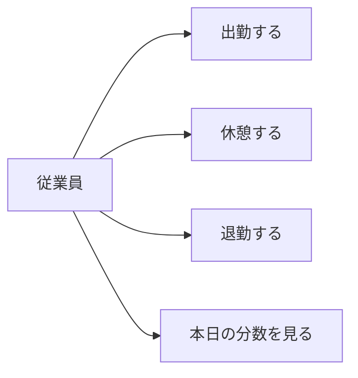
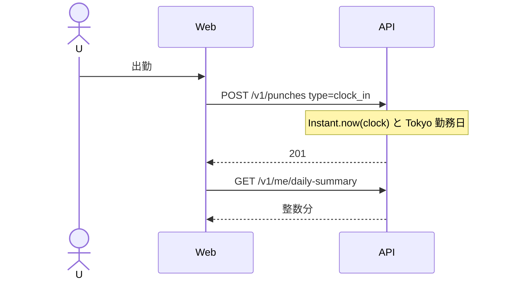
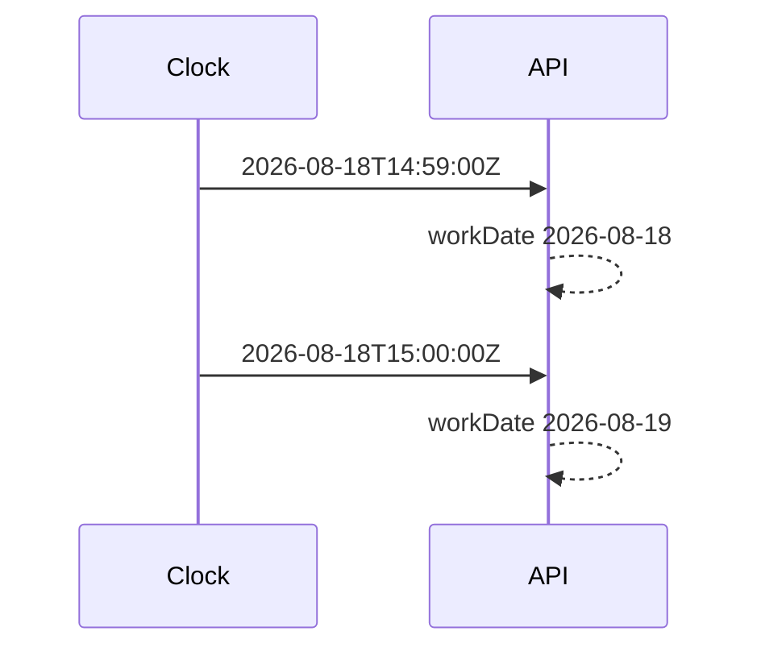
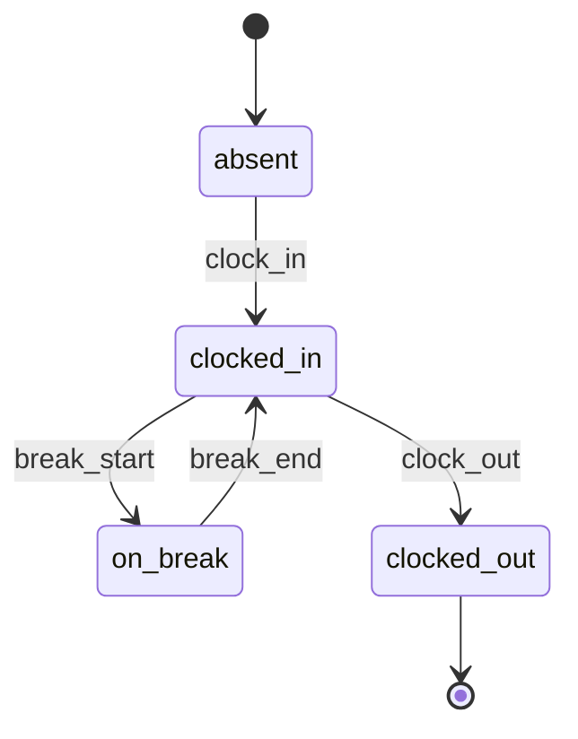
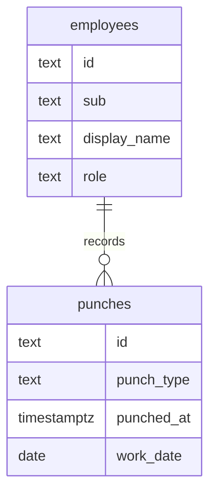

# P09 図表

| 項目 | 値 |
| --- | --- |
| プロジェクト | P09 attendance |
| 対象スライス | スライス 1 |
| 最終更新 | 2026-08-19 |
| 記法 | Mermaid |

## 1. ユースケース

月次・承認は未実装。

## 2. 画面遷移

## 3. 打刻

## 4. 日境界

## 5. 状態（1 勤務日）

## 6. ER（論理）

