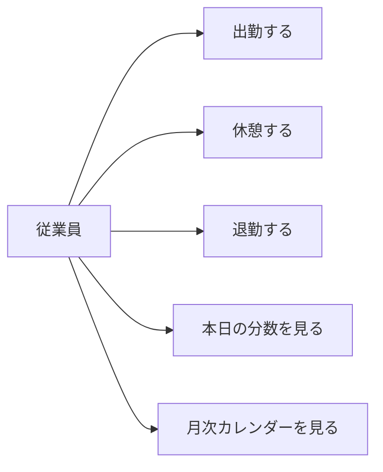
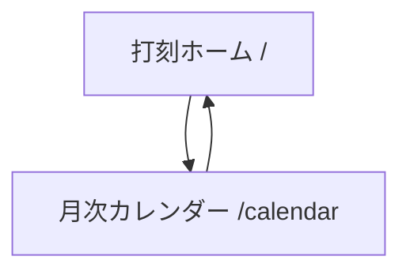
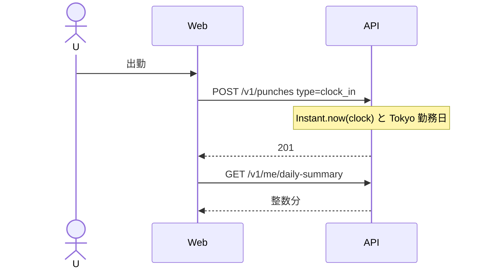
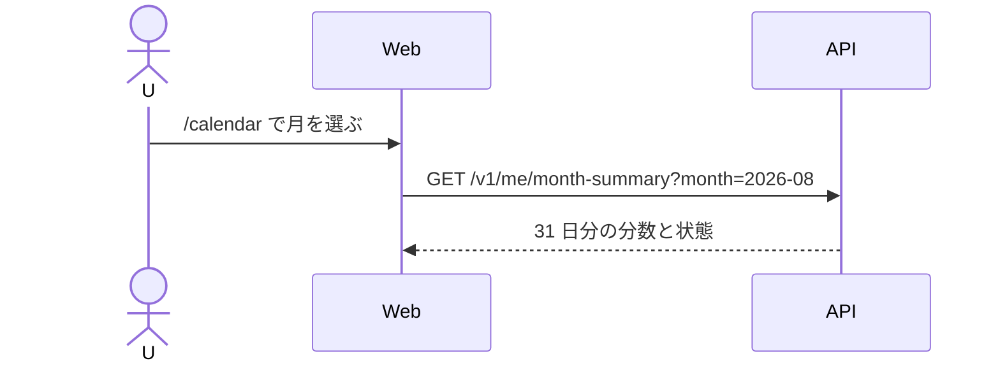
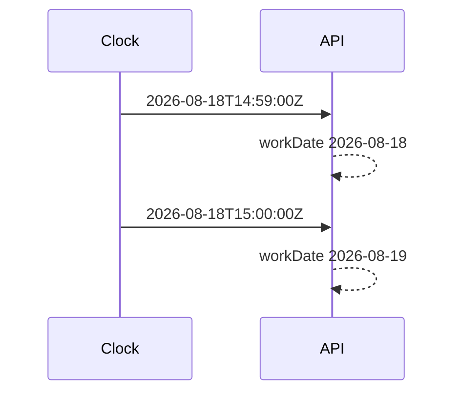
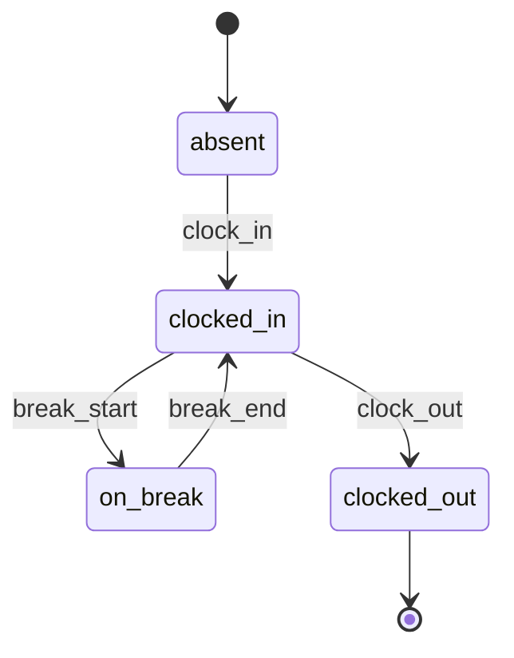
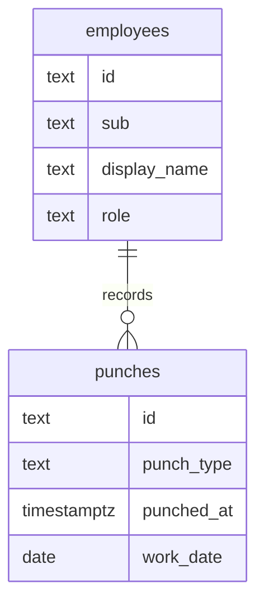

# 図表

| 項目 | 値 |
| --- | --- |
| プロダクト | attendance（GitHub: [pf-attendance](https://github.com/maeplego/pf-attendance)） |
| 最終更新 | 2026-08-19 |
| 実装との関係 | この文書と実装が違うときは、製品リポジトリのコードとテストを優先する |
| 記法 | Mermaid |

## 1. ユースケース

申請・承認・締めは未実装。

## 2. 画面遷移

## 3. 打刻

## 4. 月次カレンダー

## 5. 日境界

## 6. 状態（1 勤務日）

## 7. ER（論理）

