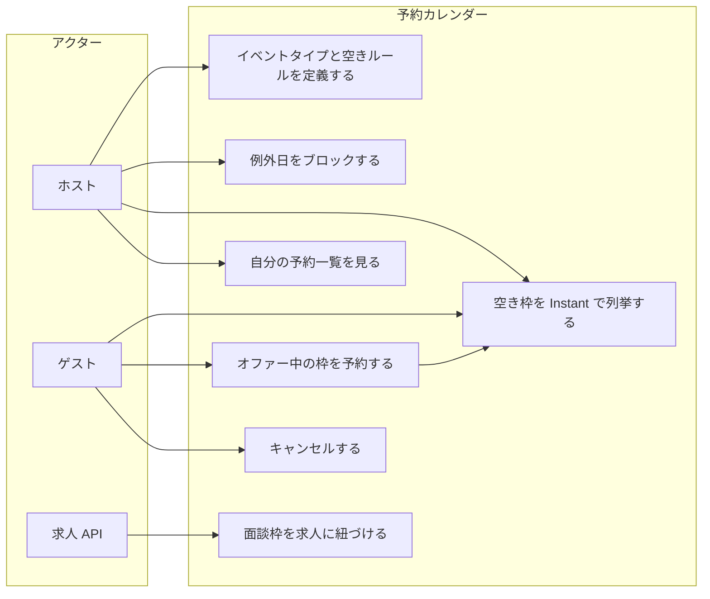
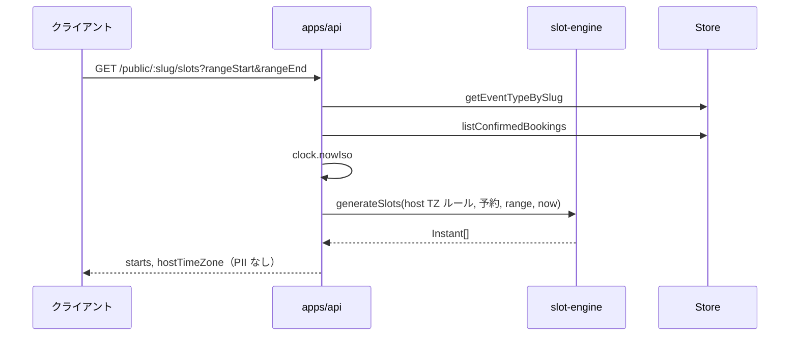
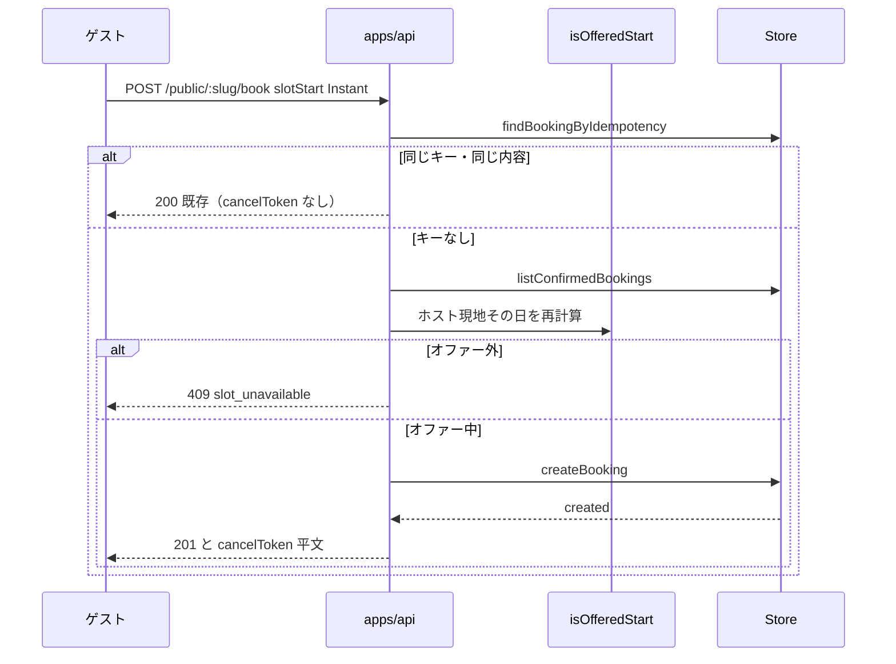
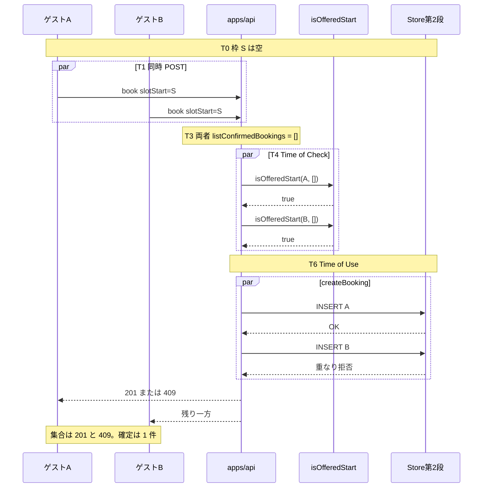
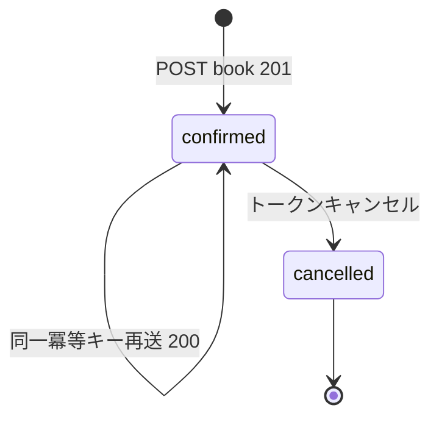
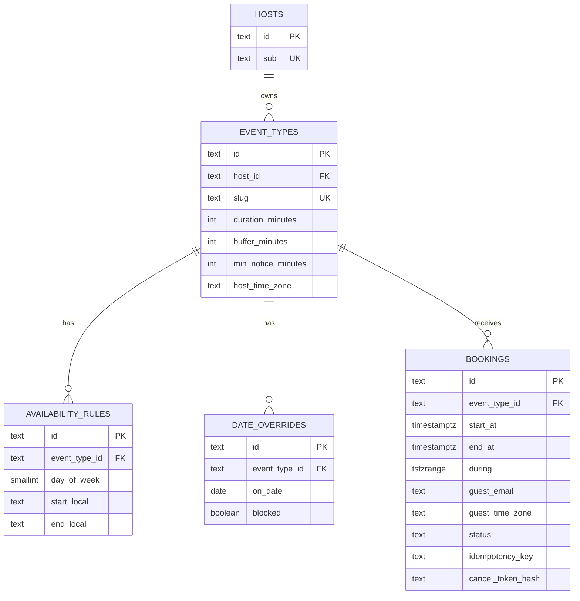

# 図表

| 項目 | 値 |
| --- | --- |
| プロダクト | 予約カレンダー [pf-calendar](https://github.com/maeplego/pf-calendar) |
| 最終更新 | 2026-08-19 |
| 実装との関係 | この文書と実装が違うときは、製品リポジトリのコードとテストを優先する |
| 記法 | Mermaid。ユースケースは UML 楕円の代替としてフロー |

詳細な文章は仕様・設計を参照する。図は構造の索引。

## 1. ユースケース



求人側の webhook 受信（`POST /webhooks/calendar`）とカレンダー側の内部 API・outbox 配信は現行。

## 2. 画面遷移（実装済み）

```mermaid
flowchart TB
  subgraph guestUi [ゲスト]
    G1[公開 URL /book/:slug]
    G2[週または日を選ぶ]
    G3[starts をゲスト TZ で表示]
    G4[氏名メールで確定]
    G5[完了_ICS とキャンセルリンク]
    G6[/cancel?token=]
    G1 --> G2 --> G3 --> G4 --> G5
    G5 --> G6
  end

  subgraph hostUi [ホスト]
    H0[/login OIDC 任意]
    H1[/host ダッシュボード]
    H2[イベントタイプ設定]
    H0 --> H1
    H1 --> H2
  end

  subgraph api [API]
    A1[GET /public/:slug/slots]
    A2[POST /public/:slug/book]
    A3[GET /v1/event-types]
    A4[POST /public/bookings/cancel]
  end

  G3 --> A1
  G4 --> A2
  G6 --> A4
  H1 --> A3
```

ゲスト TZ セレクタは G3 の表示だけを変える。A1 の `starts` は変えない。

## 3. シーケンス: 枠一覧



## 4. シーケンス: 予約成功（単独）



## 5. シーケンス: 同時 2 リクエスト（TOCTOU）

Check は両方 true。Use（INSERT）で片方だけ残る。Memory と Postgres は Store の別実装。



Postgres なら拒否は `EXCLUDE USING gist`（23P01）。Memory なら `overlapsConfirmed`（同じ関数内に await が無く、後発が見るときには先発が push 済み）。

## 6. 予約の状態



exclusion は `confirmed` だけに掛ける。cancelled 同士や cancelled と confirmed は重ならない。

## 7. ER（現行テーブル）



`during` は生成列。ユニークは `(event_type_id, idempotency_key)`。重なり禁止は gist exclusion。
