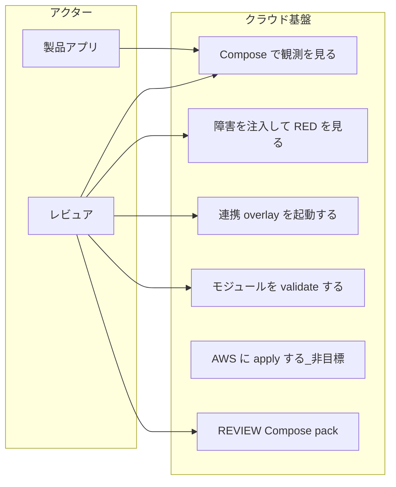
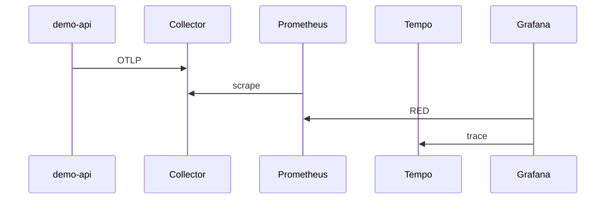
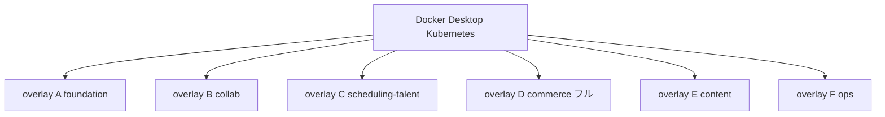
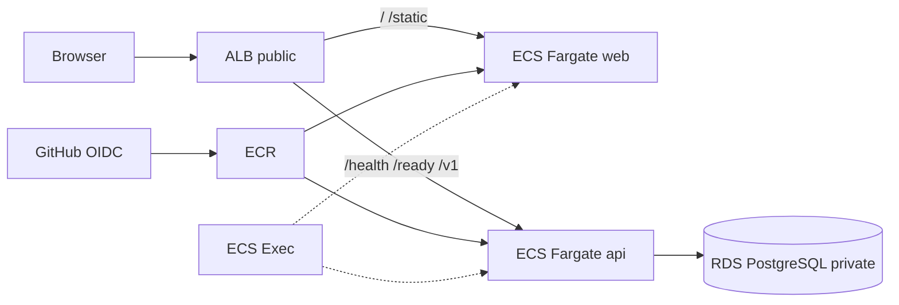

# 図表

| 項目 | 値 |
| --- | --- |
| プロダクト | クラウド基盤（観測 [pf-cloud-o11y](https://github.com/maeplego/pf-cloud-o11y) / Kubernetes [pf-cloud-k8s](https://github.com/maeplego/pf-cloud-k8s) / Terraform [pf-cloud-aws](https://github.com/maeplego/pf-cloud-aws)） |
| 最終更新 | 2026-08-19 |
| 実装との関係 | この文書と実装が違うときは、製品リポジトリのコードとテストを優先する |
| 記法 | Mermaid。ユースケースは UML 楕円の代替としてフロー |

詳細な文章は仕様・設計を参照する。図は構造の索引。

## 1. ユースケース

## 2. ローカル観測

## 3. 連携デモ（同時に全部載せない）

同時に A–F を載せない。D は EC フルと推薦。F に Expo アプリは載せない。

## 4. AWS 3-tier（モジュール。未 apply）

学習用。マルチリージョン・WAF・Blue/Green は非目標。この図を apply 済み環境と読まない。

NAT Gateway は 1。プライベートサブネットの egress（ECR pull、SSM）用。
