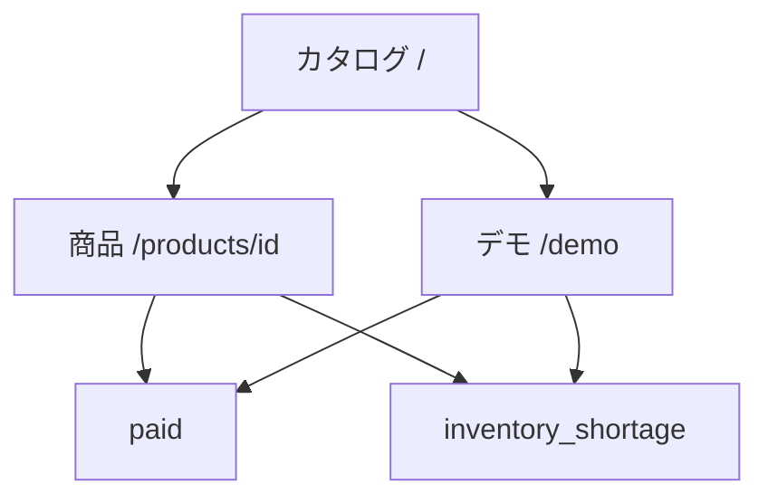
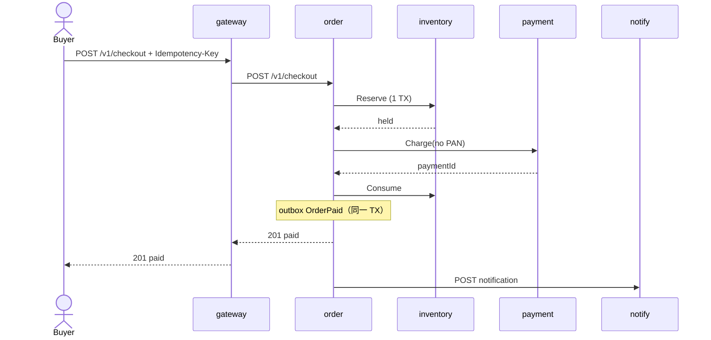
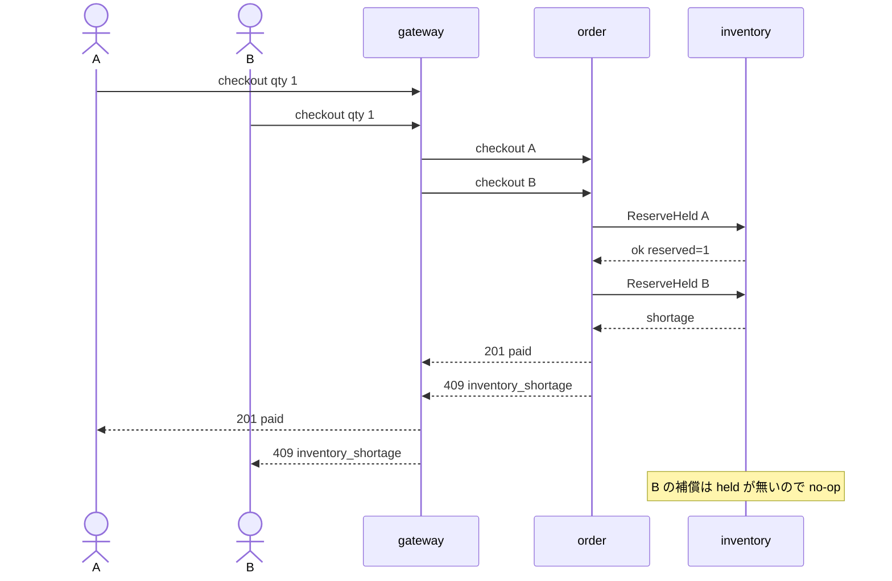
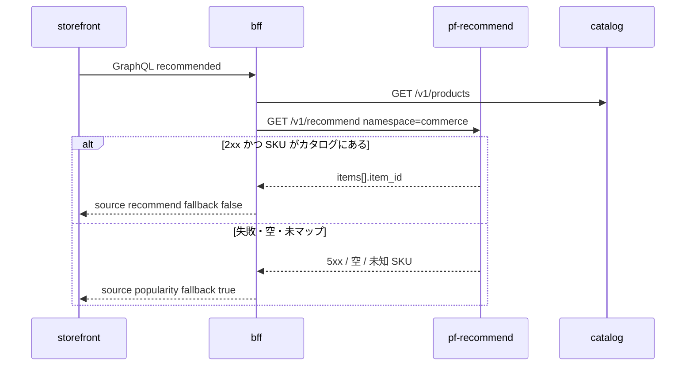
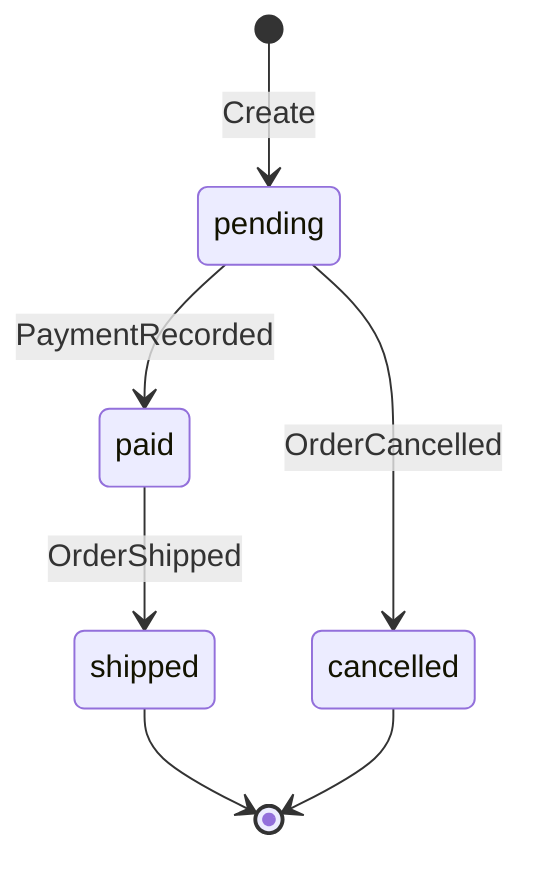
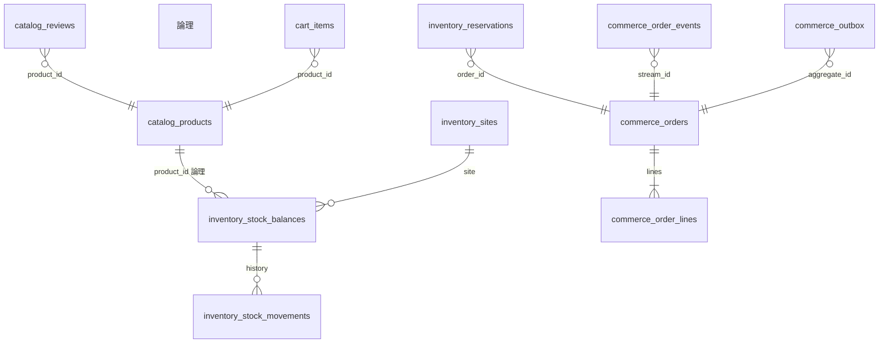

# 図表

| 項目 | 値 |
| --- | --- |
| プロダクト | EC コマース（GitHub: `pf-commerce`） |
| 最終更新 | 2026-08-19 |
| 実装との関係 | この文書と実装が違うときは、製品リポジトリのコードとテストを優先する |

記法は Mermaid。ユースケースは UML 楕円の代わりにフローで書く。Kubernetes 連携デモの commerce 構成には payment / notify / BFF / ops-web と推薦 API（`pf-recommend`）が含まれる。

## 1. ユースケース

## 2. 画面遷移

## 3. 成功時シーケンス

## 4. 在庫不足（同時 2 人）

在庫 1 に数量 2 の単独リクエストでは、Reserve が shortage のあと `ReleaseOrder` が空の held を見る。残高は UPDATE が 0 行なので減っていない。

## 5. 推薦スロット（fail-closed）

## 6. 注文状態

`Ship` は paid 以外を拒否。決済モックはカードを持たない。

## 7. ER（論理）

物理 FK は張っていない。プロセスごとに別 DB。列は各 `schema.sql` を正とする。
