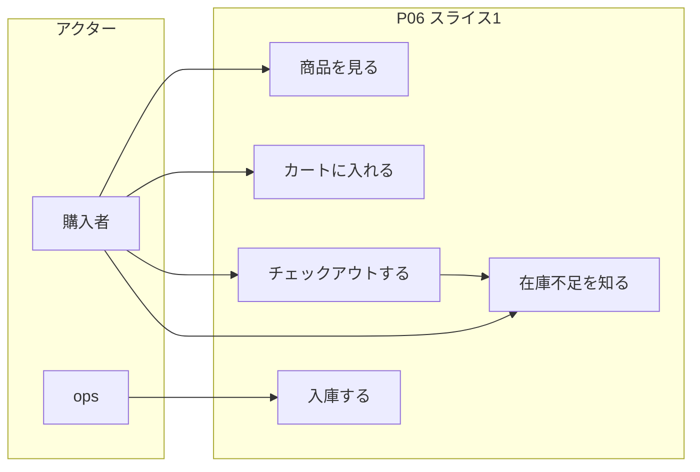
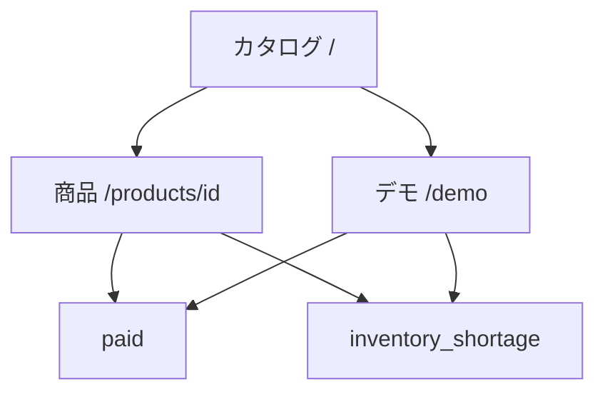
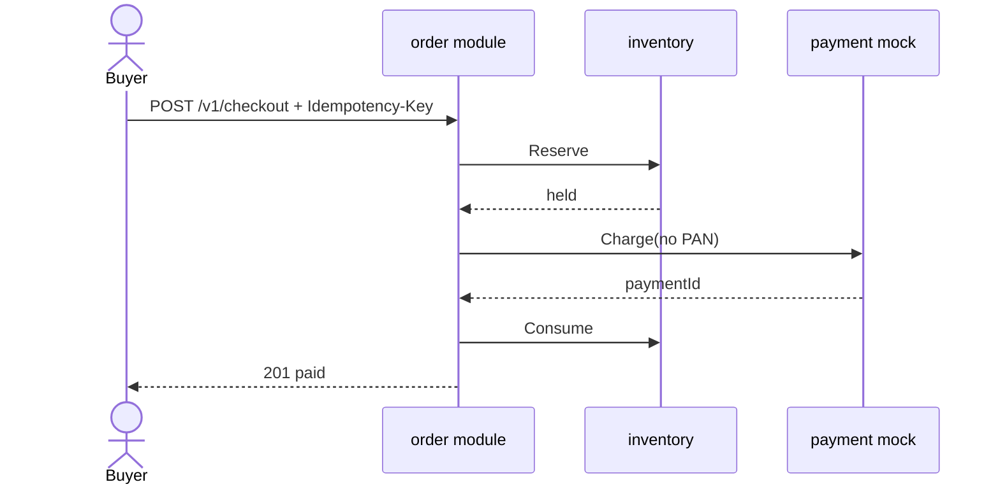
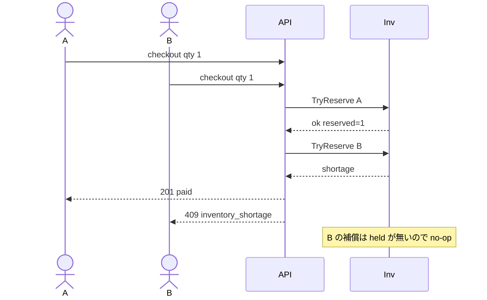
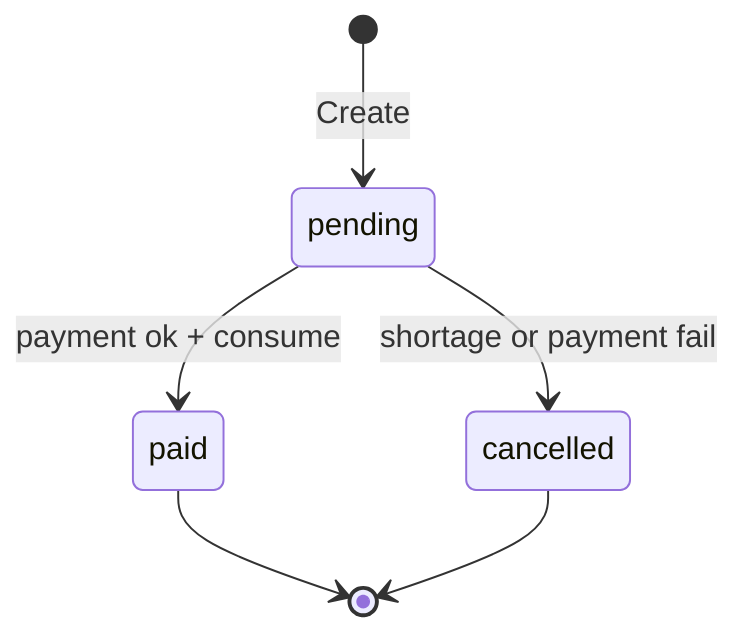
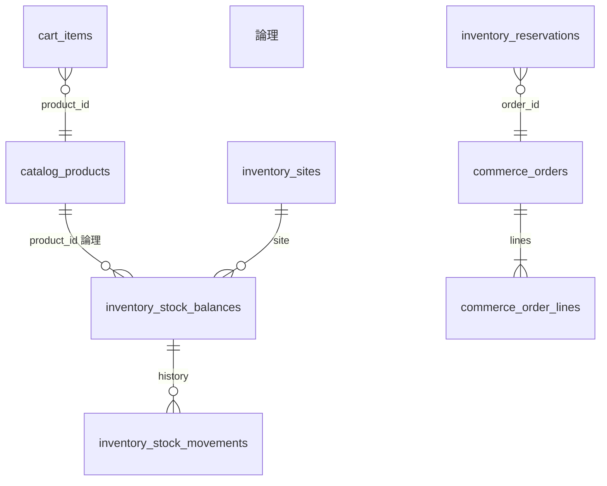

# P06 図表

| 項目 | 値 |
| --- | --- |
| プロジェクト | P06 commerce-platform |
| 対象スライス | シーケンス・状態・ER はスライス 1。画面は実装済み。抽出後は計画 |
| 最終更新 | 2026-08-19 |
| 記法 | Mermaid。ユースケースは UML 楕円の代替としてフロー |

## 1. ユースケース

## 2. 画面遷移

## 3. 成功時シーケンス

## 4. 在庫不足（同時 2 人）

在庫 1 に数量 2 の単独リクエストでは、Reserve が shortage のあと `ReleaseOrder` が空の held を見る。残高は UPDATE が 0 行なので減っていない。

## 5. 注文状態

`shipped` は未実装。不正遷移のイベントストア拒否はスライス 3。

## 6. ER（論理）

物理 FK は張っていない。列は `schema.sql` を正とする。
