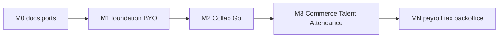

# 商用ロードマップ

| 項目 | 値 |
| --- | --- |
| 第一弾 | Collab 商用最小 |
| 最終更新 | 2026-08-21 |

評価ライセンスのまま全製品を「商用フル」と呼ばない。ゲートは [production-definition.md](./production-definition.md)。パッケージ境界は [package-catalog.md](./package-catalog.md)。差し替えは [portability.md](./portability.md)。動作確認の層は [verification.md](./verification.md)。

## マイルストーン

### M0 — 定義とカタログ（書類）

- [x] `production-definition.md`
- [x] `package-catalog.md`
- [x] `portability.md` / `portability-byo-idp.md`
- [x] 本ファイル
- [x] `cost-estimate.md` / `licensing.md` / `REVIEW.md` / `00-overview.md` からのリンク更新

**完了条件**: Collab の Go/No-Go と BYO IdP・給与税務の位置づけを文書で説明できる。

### M1 — 横断基盤（P01 + staging + テナント）

- [x] P01 本番プロファイル（`IDENTITY_ENV`、dev keys 拒否）、監査一覧・脅威モデル書類
- [x] P04 `WORKSPACE_ENV` で DEV_AUTH 拒否
- [x] BYO 手順ドラフト（`portability-byo-idp.md`）
- [x] P04 の org 隔離（memory でも tenant filter）+ `org_required` + BYO org 切替フォールバック（`rp_active_org` / `X-Workspace-Org`）
- [x] Collab staging 手順（`collab-staging.md`）と Collector down アラート骨格
- [x] overlay B 商用 staging（`docker-desktop-b-collab-staging`、DEV_AUTH オフ、デモ B と分離）
- [x] BYO モック OIDC（`pf-workspace/deploy/byo-oidc`）
- [x] Collab 最小 E2E（`pf-workspace/apps/e2e`、同梱 IdP）
- [x] P04 運用 runbook / 商用導入（docs 07–08）
- [ ] AuthPort: 顧客 Entra 等での実接続は顧客環境で（ラボはモックで代替）

**完了条件**: staging で OIDC+org・dev-auth オフ。BYO 手順が再現可能。

### M2 — Collab 商用品質（Go 判定）

- [x] 運用 runbook / 導入成果物（workspace docs 07–08、招待／chat／collab 節）
- [x] RLS／招待／共同編集／チャットの手動 runbook 要約（詳細は仕様・テスト。顧客一枚絵は Risk Accept）
- [x] AuthPort 経由の BYO フォールバック（Cookie / X-Workspace-Org）
- [x] Blob 顧客バケット手順（[media-platform/docs/07-customer-bucket.md](./media-platform/docs/07-customer-bucket.md)）
- [x] production-definition チェックリストで **Go**（評価 LICENSE のまま実課金は不可）
- [x] staging で [09-backup-restore-drill.md](./workspace/docs/09-backup-restore-drill.md) を 1 回記入（2026-08-21 Pass）
- [x] 招待一枚絵・SLO／監査保持／脆弱性方針（[10-invite-visibility.md](./workspace/docs/10-invite-visibility.md)、[collab-slo-security.md](./collab-slo-security.md)）

**完了条件**: 顧客 PoC に実データを入れる判断ができる（ゲート Go。契約・法務の個別確定は顧客オンボ）。

### M3 — 次パッケージ（各々別計画で実装）

順序の既定: **Commerce → Talent → Attendance → その他**。  
各パッケージで M1 チェックリストを再利用。決済・労基は「名乗るなら専門家レビュー必須」。

- [x] Commerce: `COMMERCE_ENV` staging/production で DEV_AUTH 拒否（gateway + order）
- [x] Commerce staging 手順・overlay 入口（[commerce-staging.md](./commerce-staging.md)、`docker-desktop-d-commerce-staging`）
- [x] Commerce: cluster スモーク脚本（`cluster-smoke-d-commerce-staging.ps1`）
- [x] Commerce: cluster スモーク実行記録（2026-08-21 Pass: DEV_AUTH 401・Ingress health）
- [x] Commerce: ゲート自己監査（[commerce-platform/docs/07-commerce-gate.md](./commerce-platform/docs/07-commerce-gate.md)、バックアップ [08-backup-restore-drill.md](./commerce-platform/docs/08-backup-restore-drill.md)）
- [x] Talent: `TALENT_ENV` staging/production で DEV_AUTH 拒否
- [x] Media: `MEDIA_ENV` staging/production で DEV_AUTH 拒否
- [x] Media staging を Collab/Commerce staging overlay に載せる（[media-staging.md](./media-staging.md)）
- [x] Media: Collab staging cluster で DEV_AUTH 401 記録（2026-08-21 Pass）
- [x] Calendar: `CALENDAR_ENV` staging/production で DEV_AUTH 拒否
- [x] Attendance: `ATTENDANCE_ENV` staging/production で DEV_AUTH 拒否
- [x] Talent path staging overlay／手順（[talent-staging.md](./talent-staging.md)、`docker-desktop-c-scheduling-talent-staging`）
- [x] Talent path: cluster スモーク（2026-08-21 Pass: DEV_AUTH 401・talent/calendar Ingress health）
- [x] Talent path: ゲート自己監査・バックアップ実演（[talent-platform/docs/07-talent-gate.md](./talent-platform/docs/07-talent-gate.md)、[08-backup-restore-drill.md](./talent-platform/docs/08-backup-restore-drill.md)）
- [x] Attendance: staging overlay／手順（[attendance-staging.md](./attendance-staging.md)、`docker-desktop-f-ops-staging`）
- [x] Attendance: cluster スモーク実行記録（2026-08-21 Pass: Quick・DEV_AUTH 401・Ingress health）
- [x] Attendance: ゲート自己監査・バックアップ実演（[attendance/docs/07-attendance-gate.md](./attendance/docs/07-attendance-gate.md)、[08-backup-restore-drill.md](./attendance/docs/08-backup-restore-drill.md)）
- 棚卸し正本: [implementation-backlog-by-pxx.md](./implementation-backlog-by-pxx.md)

### MN — 商用第 N 弾（規制ドメイン／バックオフィス）

**方針の正本**: [mn-payroll-tax.md](./mn-payroll-tax.md)。製品 ID は **P16 payroll-platform**（`../pf-payroll`）。staging: [payroll-staging.md](./payroll-staging.md)。

**やる**: 給与連携 →（任意）薄いドメイン →（ゲート後のみ）源泉・年末調整等を名乗る。フル自前 ERP は非優先。

| 段階 | 内容 | 状態 |
| --- | --- | --- |
| MN0 | 方針・Ports・P16 予約、カタログ対象外の維持 | **完了**（2026-08-21） |
| MN1 | P09 集計エクスポート + `PayrollExportPort` / `AccountingPort` モック | **完了**（`pf-payroll` + f-ops-staging） |
| MN2 | 薄いドメイン／明細プレビュー（disclaimer 常時） | **完了**（2026-08-21） |
| MN3 | 規制名乗り（専門家レビュー後のみ） | **未着手** — 手順は [mn-payroll-tax.md](./mn-payroll-tax.md) |

- 着手条件: M2 Go 済み、M3 主要パッケージ（Commerce / Talent / Attendance）の staging 入口済み
- ゲート: [mn-payroll-tax.md](./mn-payroll-tax.md) の拡張項目。Collab の production-definition を土台にする
- それまでの間: カタログ上は対象外。顧客には既存給与／会計 SaaS＋エクスポートを推奨
- **作らない**: P09/P14 への給与ロジック混入、空の `pf-payroll` だけ先行作成

## 残課題・意図的非目標（当面）

- 15 製品同時本番、デモ非目標の一括解禁
- `terraform apply` 本番必須化（staging 再現を優先）
- 労基を名乗った勤怠、PCI 本格決済（名乗るなら別ゲート）
- 全面ヘキサゴナル Pure 化
- MN 完了前の「給与・税務できます」表記

## 最初の 30 日（実行目安）

| 週 | 成果 |
| --- | --- |
| 1 | M0 書類（本ディレクトリ） |
| 2 | P01 本番プロファイル、P04 IdP 依存棚卸し |
| 3 | staging + 境界テスト、BYO OIDC 手順ドラフト |
| 4 | 最小 E2E、Collab runbook、ゲート自己監査 |

## 関連

- [collab-staging.md](./collab-staging.md)
- [commerce-staging.md](./commerce-staging.md)
- [talent-staging.md](./talent-staging.md)
- [attendance-staging.md](./attendance-staging.md)
- [media-staging.md](./media-staging.md)
- [mn-payroll-tax.md](./mn-payroll-tax.md)
- [implementation-backlog-by-pxx.md](./implementation-backlog-by-pxx.md)
