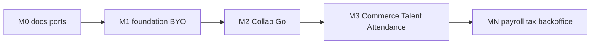

# 商用ロードマップ

| 項目 | 値 |
| --- | --- |
| 第一弾 | Collab 商用最小 |
| 最終更新 | 2026-08-21 |

評価ライセンスのまま全製品を「商用フル」と呼ばない。ゲートは [production-definition.md](./production-definition.md)。パッケージ境界は [package-catalog.md](./package-catalog.md)。差し替えは [portability.md](./portability.md)。

## マイルストーン

### M0 — 定義とカタログ（書類）

- [x] `production-definition.md`
- [x] `package-catalog.md`
- [x] `portability.md` / `portability-byo-idp.md`
- [x] 本ファイル
- [x] `cost-estimate.md` / `licensing.md` / `REVIEW.md` / `00-overview.md` からのリンク更新

**完了条件**: Collab の Go/No-Go と BYO IdP・給与税務の位置づけを文書で説明できる。

### M1 — 横断基盤（P01 + staging + テナント）

- [x] P01 本番プロファイル（`IDENTITY_ENV`、dev keys 拒否）、監査一覧・脅威モデル書類
- [x] P04 `WORKSPACE_ENV` で DEV_AUTH 拒否
- [x] BYO 手順ドラフト（`portability-byo-idp.md`）
- [x] P04 の org 隔離（memory でも tenant filter）+ `org_required` + BYO org 切替フォールバック（`rp_active_org` / `X-Workspace-Org`）
- [x] Collab staging 手順（`collab-staging.md`）と Collector down アラート骨格
- [x] overlay B 商用 staging（`docker-desktop-b-collab-staging`、DEV_AUTH オフ、デモ B と分離）
- [x] BYO モック OIDC（`pf-workspace/deploy/byo-oidc`）
- [x] Collab 最小 E2E（`pf-workspace/apps/e2e`、同梱 IdP）
- [x] P04 運用 runbook / 商用導入（docs 07–08）
- [ ] AuthPort: 顧客 Entra 等での実接続は顧客環境で（ラボはモックで代替）

**完了条件**: staging で OIDC+org・dev-auth オフ。BYO 手順が再現可能。

### M2 — Collab 商用品質（Go 判定）

- [x] 運用 runbook / 導入成果物（workspace docs 07–08）
- [ ] RLS／招待／共同編集／チャットの追加ゲート（手動 runbook 拡充は継続）
- [x] AuthPort 経由の BYO フォールバック（Cookie / X-Workspace-Org）
- [ ] Blob 顧客バケット手順の顧客向け厚み
- production-definition チェックリストで Go または Risk Accept

**完了条件**: 顧客 PoC に実データを入れる判断ができる。

### M3 — 次パッケージ（各々別計画で実装）

順序の既定: **Commerce → Talent → Attendance → その他**。  
各パッケージで M1 チェックリストを再利用。決済・労基は「名乗るなら専門家レビュー必須」。

### MN — 商用第 N 弾（規制ドメイン／バックオフィス）

**やる（方針確定）**: 給与計算、税務（源泉・年末調整寄り）、経費精算、会計連携などを製品化または深い連携として提供する。

- 着手時期: M2 完了後、M3 の主要パッケージが進んだあとを想定（番号 N は状況で決定）
- 実装方針: フル自前 ERP より **ドメインロジック + AccountingPort / PayrollExportPort**（既存 freee 等）
- ゲート: 法令・税理士／社労士レビュー、監査証跡、テナント隔離、BYO 会計 SaaS
- それまでの間: カタログ上は対象外。顧客には既存給与／会計 SaaS＋エクスポートを推奨

## 残課題・意図的非目標（当面）

- 15 製品同時本番、デモ非目標の一括解禁
- `terraform apply` 本番必須化（staging 再現を優先）
- 労基を名乗った勤怠、PCI 本格決済（名乗るなら別ゲート）
- 全面ヘキサゴナル Pure 化
- MN 完了前の「給与・税務できます」表記

## 最初の 30 日（実行目安）

| 週 | 成果 |
| --- | --- |
| 1 | M0 書類（本ディレクトリ） |
| 2 | P01 本番プロファイル、P04 IdP 依存棚卸し |
| 3 | staging + 境界テスト、BYO OIDC 手順ドラフト |
| 4 | 最小 E2E、Collab runbook、ゲート自己監査 |

## 関連

- [cost-estimate.md](./cost-estimate.md)（Collab 商用最小の行）
- [git-branching.md](./git-branching.md)
- [REVIEW.md](./REVIEW.md)
