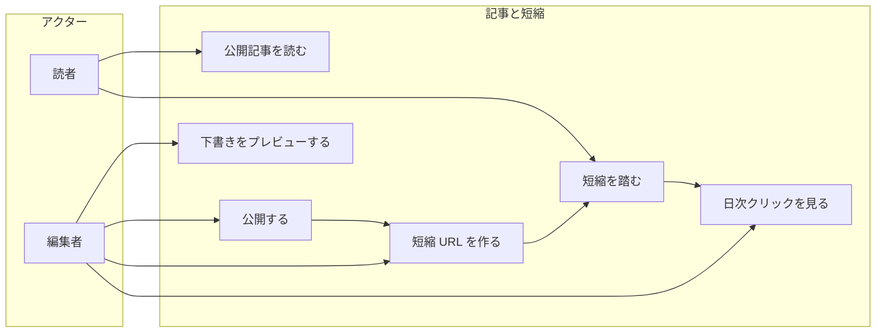
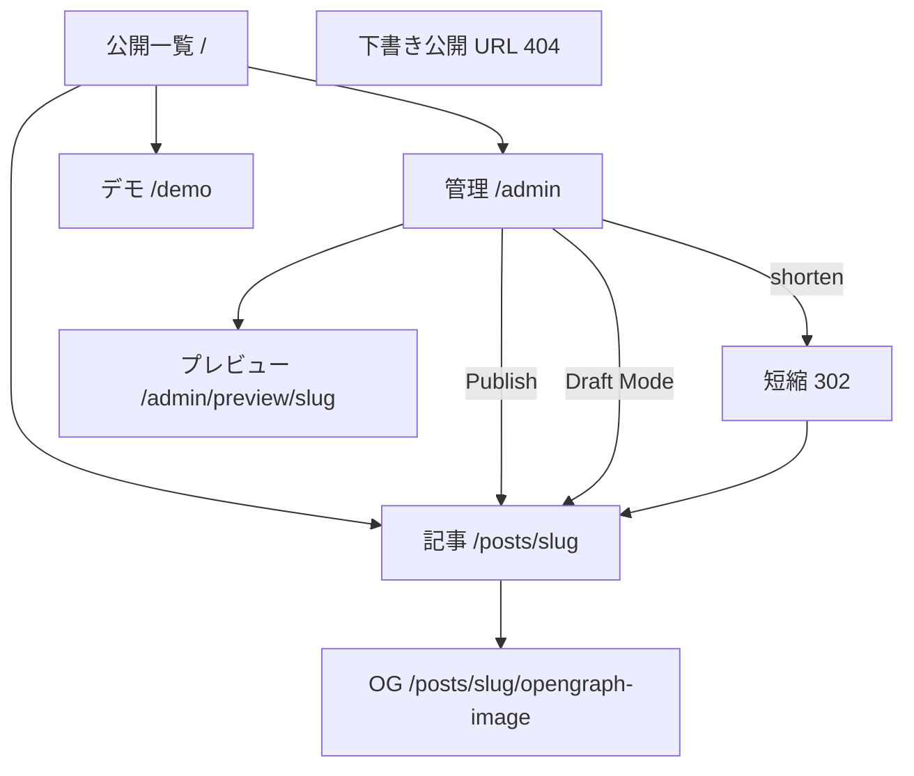
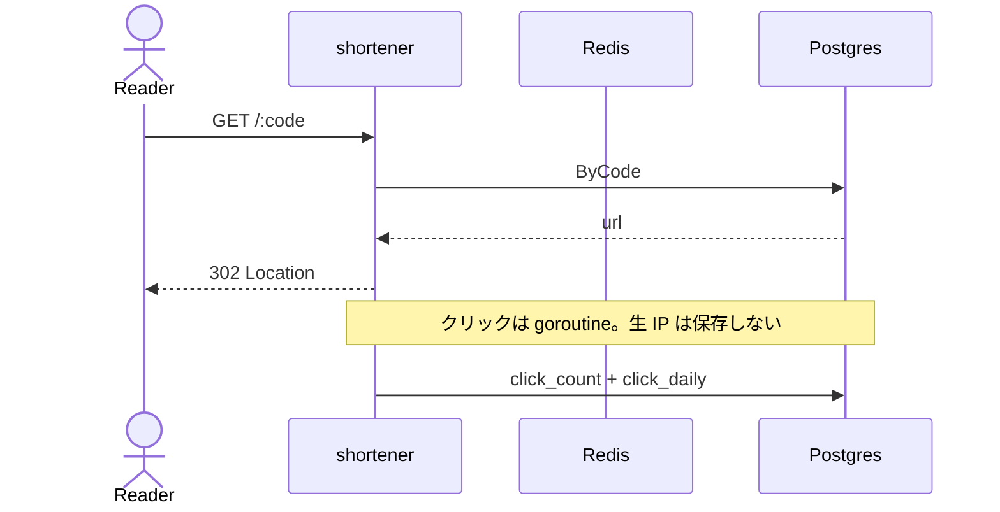
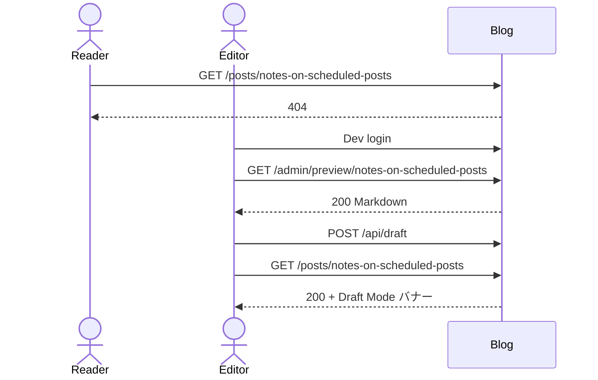
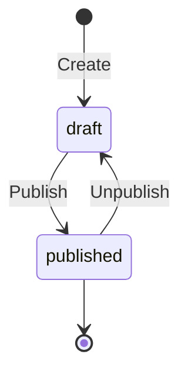
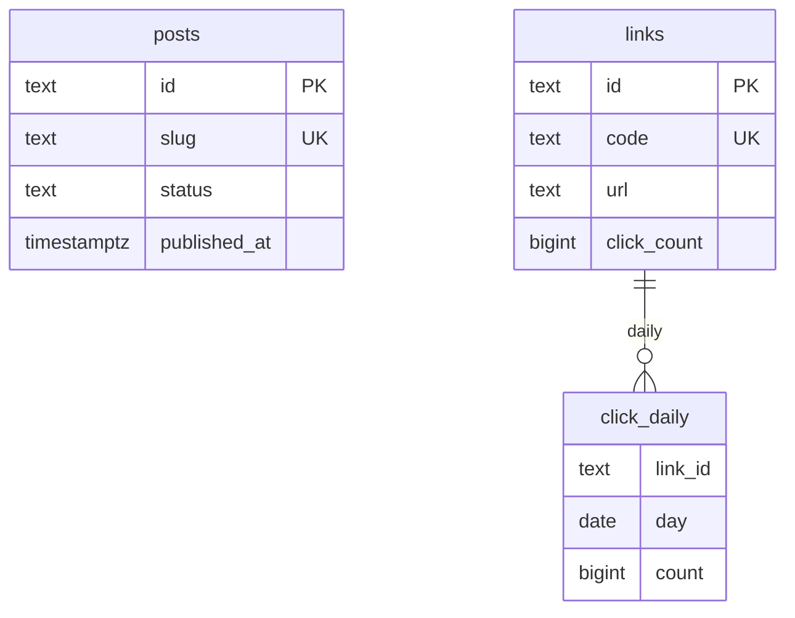

# 図表

| 項目 | 値 |
| --- | --- |
| プロダクト | コンテンツ基盤（GitHub: `pf-content-blog`、`pf-content-shortener`） |
| 最終更新 | 2026-08-19 |
| 実装との関係 | この文書と実装が違うときは、製品リポジトリのコードとテストを優先する |

記法は Mermaid。ユースケースは UML 楕円の代わりにフローで書く。Kubernetes の content 構成は Compose の任意の連携デモであり、開発者ポータルは載せない。

## 1. ユースケース

## 2. 画面遷移

## 3. 短縮ヒット（成功）

## 4. 下書きを公開 URL に出さない

## 5. 記事状態

予約投稿ワーカーは未実装。未来の `publishedAt` は `isPublic` が false のまま。

## 6. ER（論理）

記事と短縮に物理 FK は無い。紐づけは管理操作で作る URL 一致。
