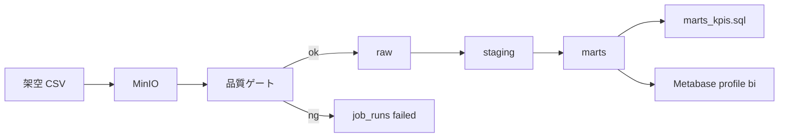
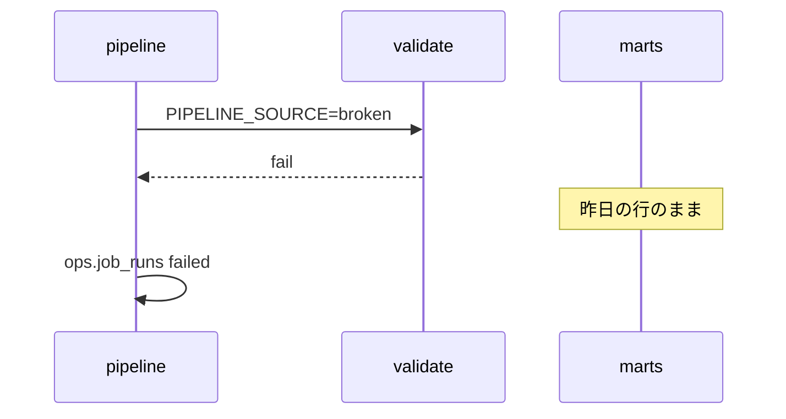

# 図表

| 項目 | 値 |
| --- | --- |
| プロダクト | data-platform（GitHub: [pf-data](https://github.com/maeplego/pf-data)） |
| 最終更新 | 2026-08-19 |
| 実装との関係 | この文書と実装が違うときは、製品リポジトリのコードとテストを優先する |
| 記法 | Mermaid |

## DAG

Metabase は任意プロファイル。パイプライン本体とは独立に起動する。

## 失敗時

