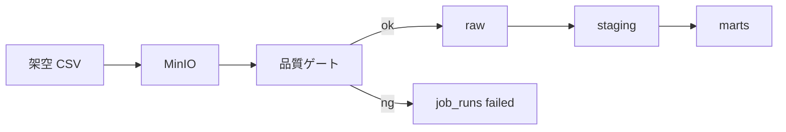

# P13 図表

| 項目 | 値 |
| --- | --- |
| プロジェクト | P13 data-platform |
| 対象スライス | 現行 DAG。P06 ソースは計画 |
| 最終更新 | 2026-08-19 |
| 矛盾時の正 | 自動テストと製品コード、次に `DESIGN.md` |
| 記法 | Mermaid |

```mermaid
flowchart LR
  CSV[架空 CSV] --> MinIO
  MinIO --> Gate[品質ゲート]
  Gate -->|ok| Raw[raw]
  Gate -->|ng| Fail[job_runs failed]
  Raw --> Stg[staging]
  Stg --> Mart[marts]
```
