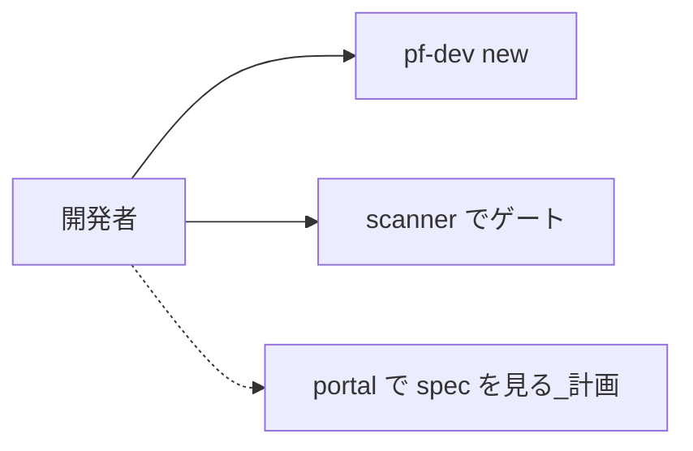

# P11 図表

| 項目 | 値 |
| --- | --- |
| プロジェクト | P11 developer-platform |
| 対象スライス | scanner + CLI。portal 画面遷移は計画 |
| 最終更新 | 2026-08-19 |
| 矛盾時の正 | 自動テストと製品コード、次に `DESIGN.md` |
| 記法 | Mermaid |

計画の画面遷移: ポータルに OpenAPI を置き Try it out。未実装。
