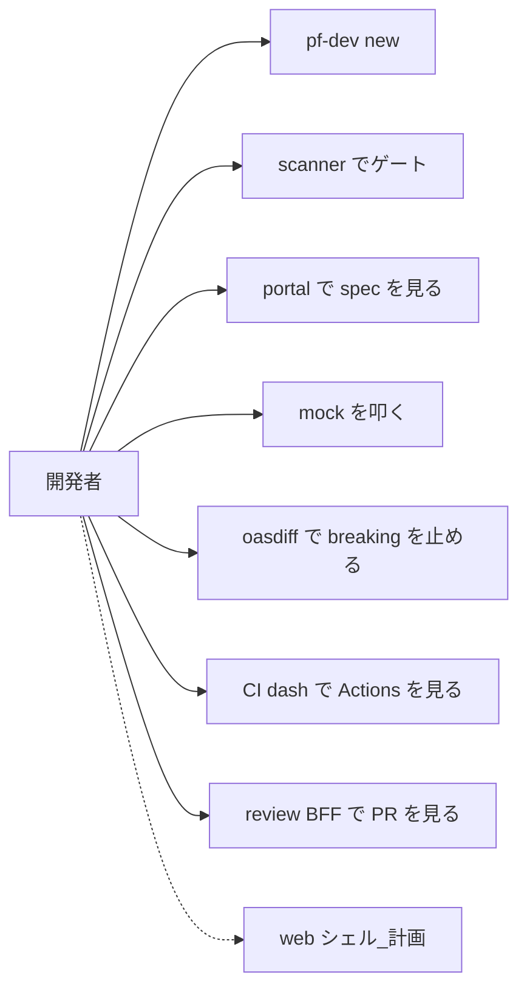
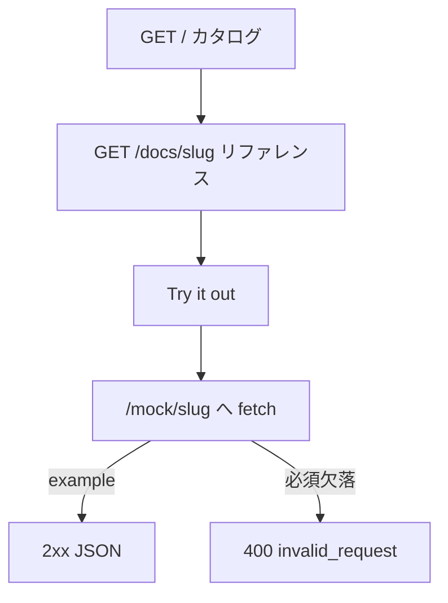
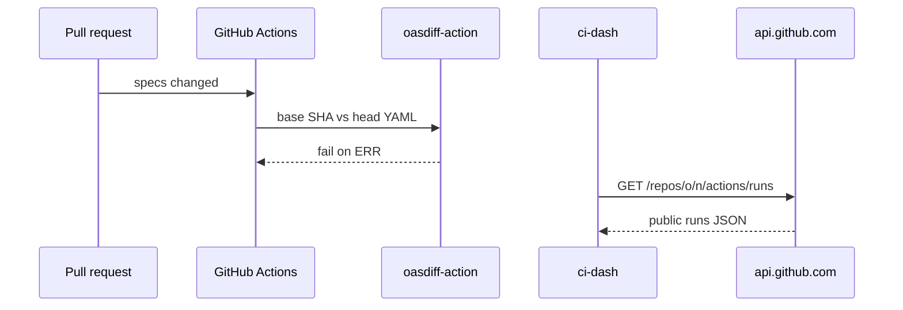

# P11 図表

| 項目 | 値 |
| --- | --- |
| プロジェクト | P11 developer-platform |
| 対象スライス | scanner + CLI + portal + oasdiff + CI dash + review。web シェルは計画 |
| 最終更新 | 2026-08-19 |
| 矛盾時の正 | 自動テストと製品コード、次に `DESIGN.md` |
| 記法 | Mermaid |

## ポータル画面遷移（実装済み）

## oasdiff / GitHub BFF

