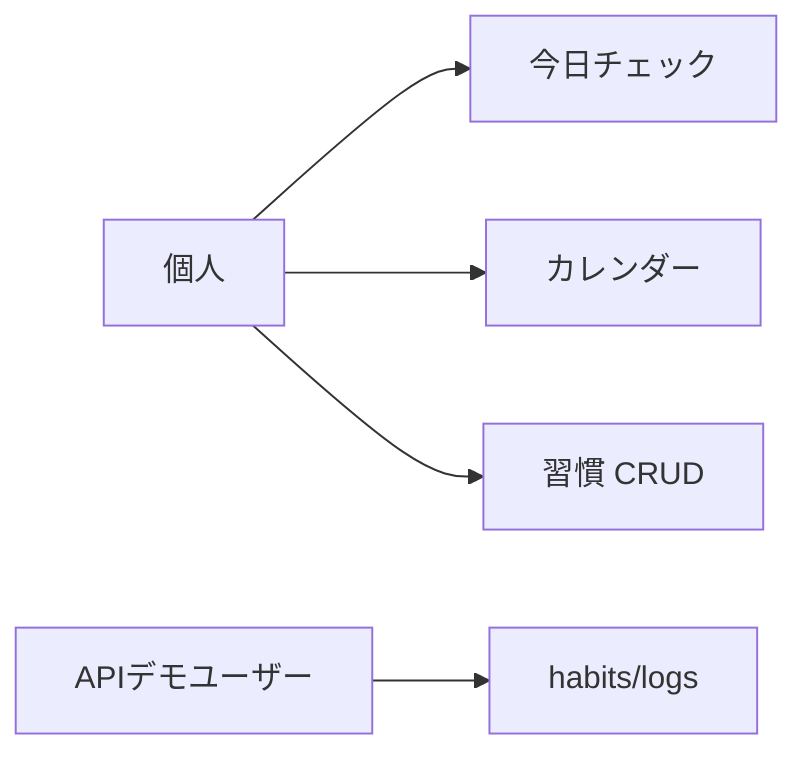
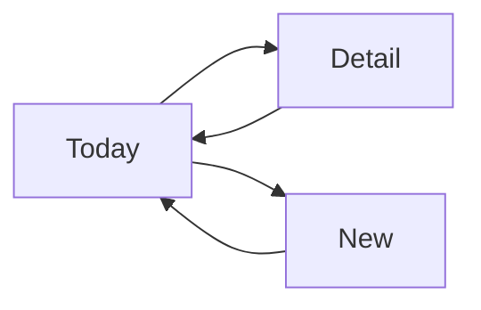
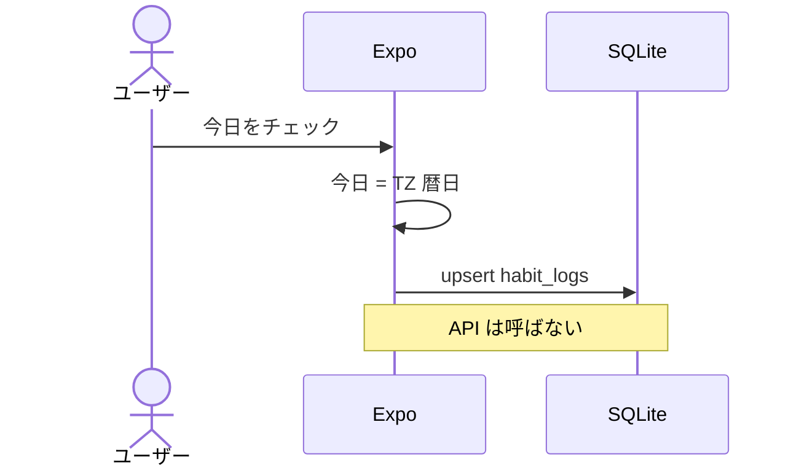
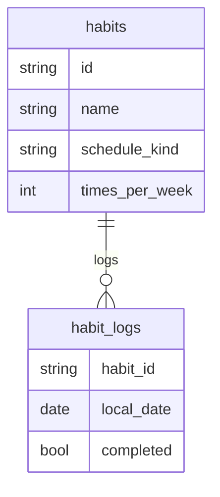

# P15 図表

| 項目 | 値 |
| --- | --- |
| プロジェクト | P15 habit-tracker |
| 対象スライス | 1 |
| 最終更新 | 2026-08-19 |

## ユースケース

## 画面遷移（実装済み）

通知設定・統計・アカウントは未実装。

## チェック（オフライン）

## ER（モバイル SQLite / API Postgres 同型）

API は `users` を足し、habits.user_id で隔離する。
