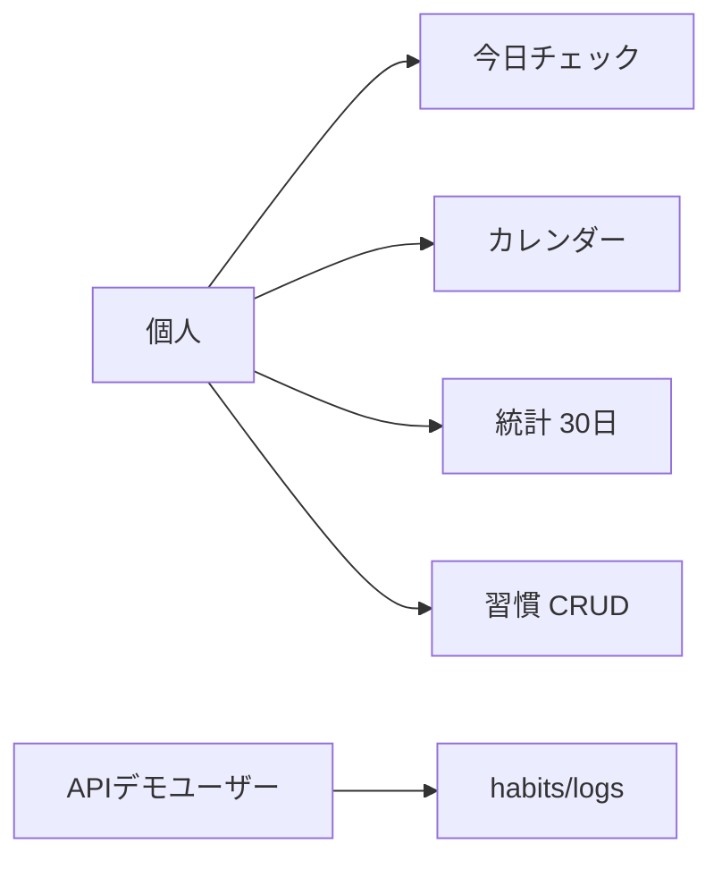
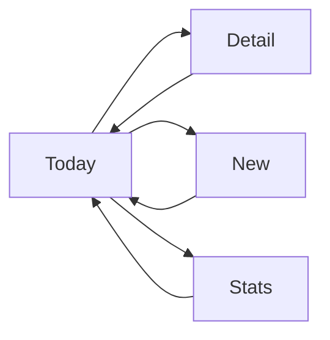
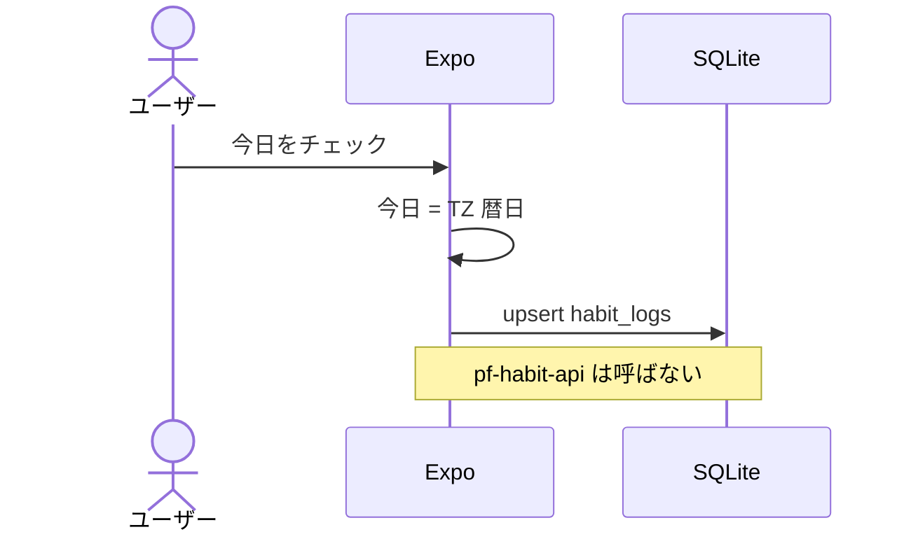
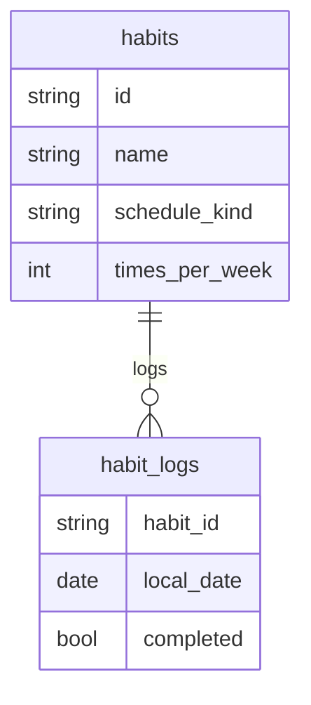

# 図表

| 項目 | 値 |
| --- | --- |
| プロダクト | habit-tracker（GitHub: [pf-habit-mobile](https://github.com/maeplego/pf-habit-mobile)、[pf-habit-api](https://github.com/maeplego/pf-habit-api)） |
| 最終更新 | 2026-08-19 |
| 実装との関係 | この文書と実装が違うときは、製品リポジトリのコードとテストを優先する |
| 記法 | Mermaid |

## ユースケース

## 画面遷移（実装済み）

通知設定とアカウント連携は未実装。統計は実装済み。

## チェック（オフライン・API なし）

## ER（モバイル SQLite / API Postgres 同型）

API は `users` を足し、habits.user_id で隔離する。どちらも Kubernetes には載せない。
