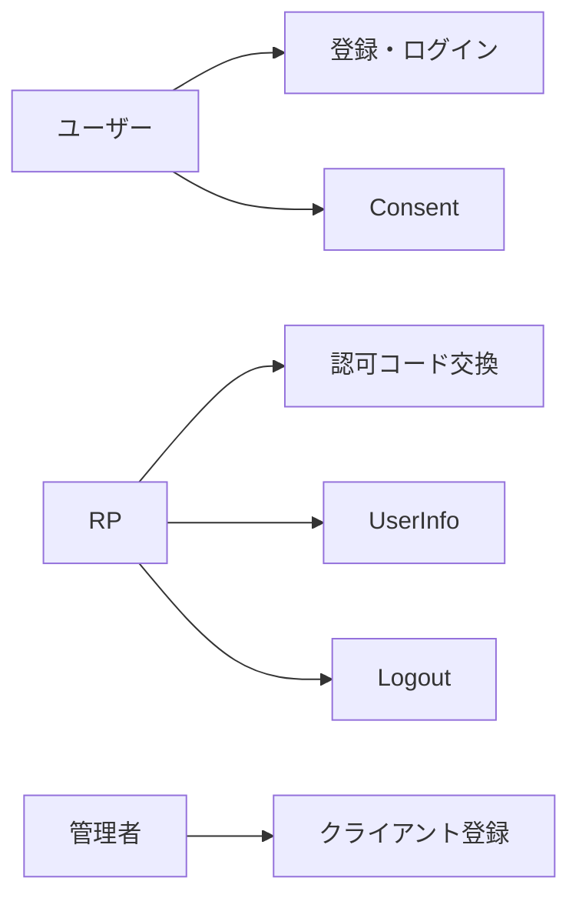
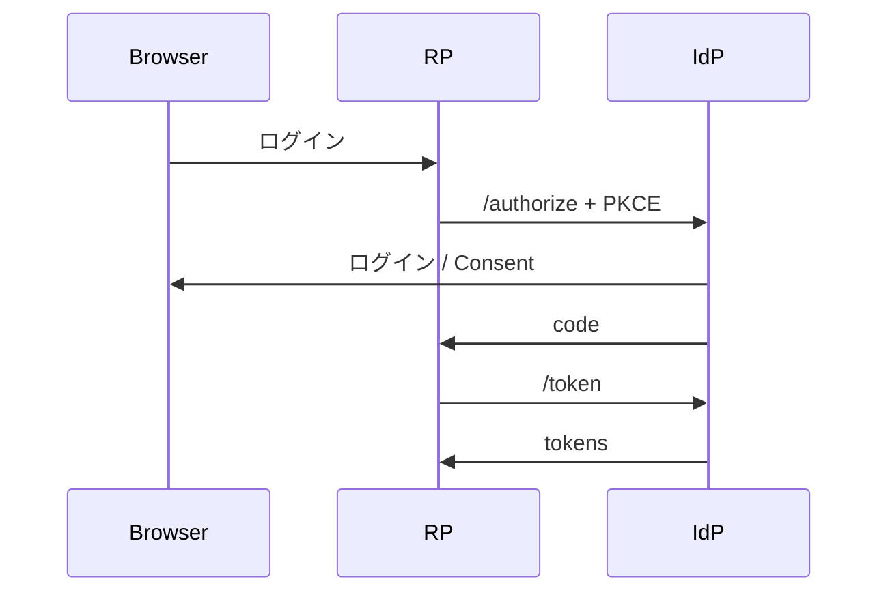

# P01 図表

| 項目 | 値 |
| --- | --- |
| プロジェクト | P01 identity-platform |
| 対象スライス | 認可コード。画面は実装済みログイン / Consent |
| 最終更新 | 2026-08-19 |
| 矛盾時の正 | 自動テストと製品コード、次に `DESIGN.md` |
| 記法 | Mermaid |

未実装: メール検証フロー、パスキー。計画として図に足さない（非目標に近いものは書かない）。
