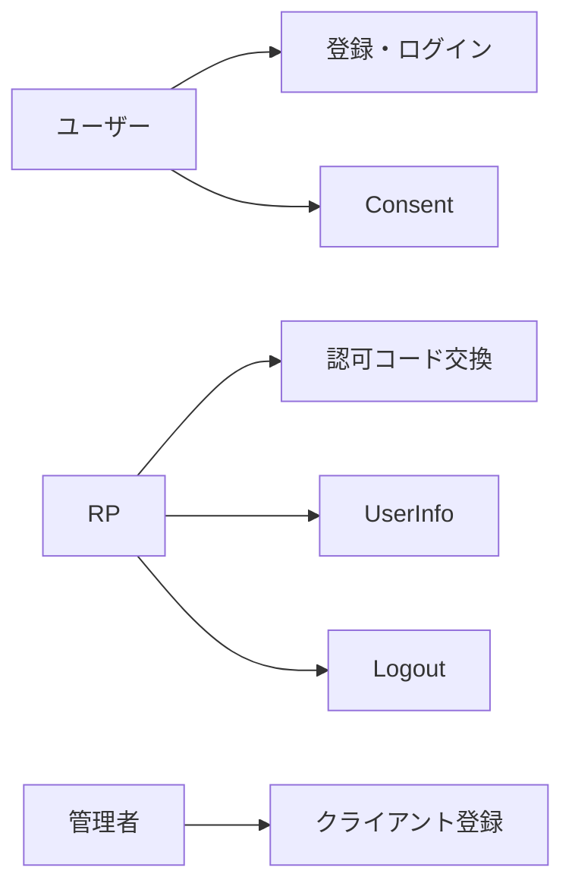
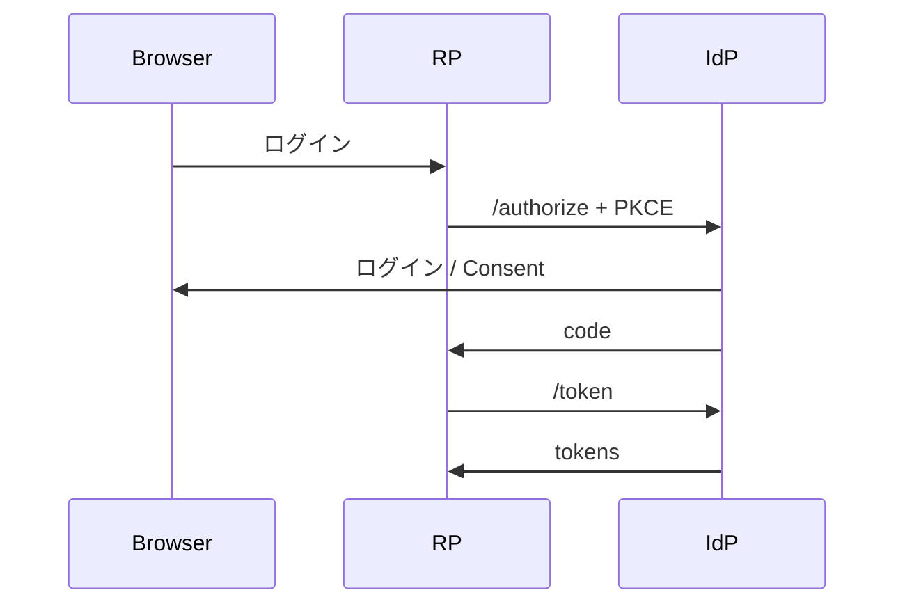

# 図表

| 項目 | 値 |
| --- | --- |
| プロダクト | 認証基盤 [pf-identity](https://github.com/maeplego/pf-identity) |
| 最終更新 | 2026-08-19 |
| 実装との関係 | この文書と実装が違うときは、製品リポジトリのコードとテストを優先する |
| 記法 | Mermaid |

ログイン画面と Consent は実装済み。メール検証やパスキーは図に含めない（未実装または非目標）。

