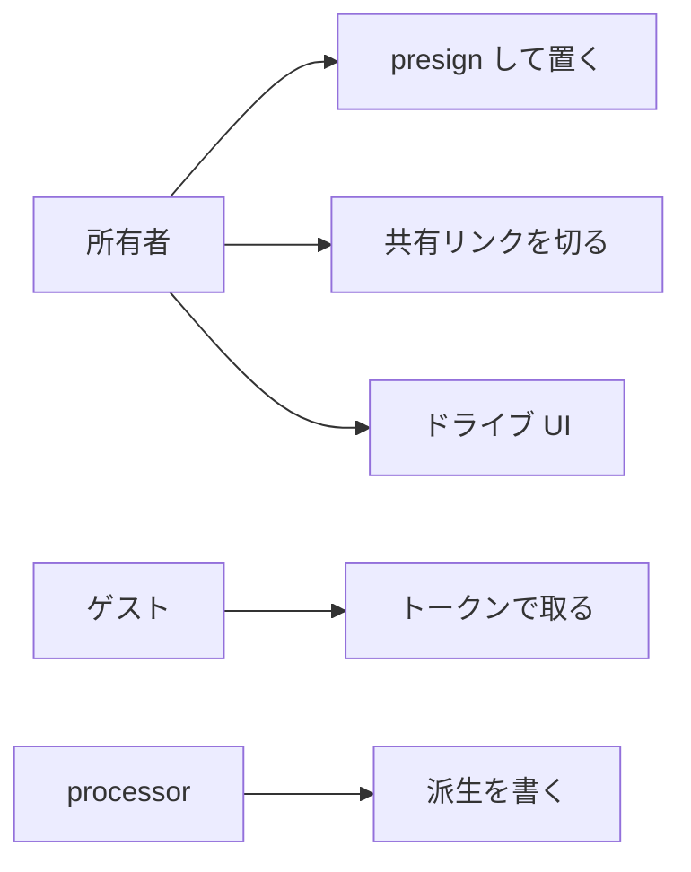
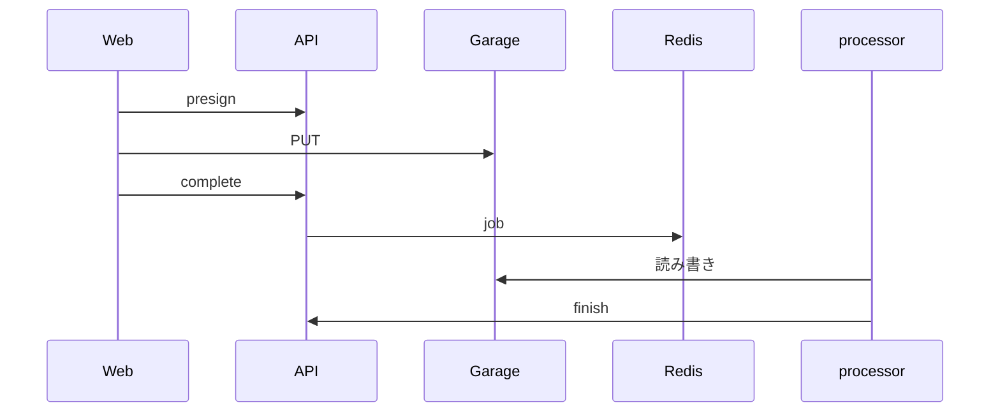

# 図表

| 項目 | 値 |
| --- | --- |
| プロダクト | メディア基盤 [pf-media](https://github.com/maeplego/pf-media) |
| 最終更新 | 2026-08-19 |
| 実装との関係 | この文書と実装が違うときは、製品リポジトリのコードとテストを優先する |
| 記法 | Mermaid |

マイドライブ UI は実装済み。AWS Lambda 本番経路は未実装のため図に含めない。

