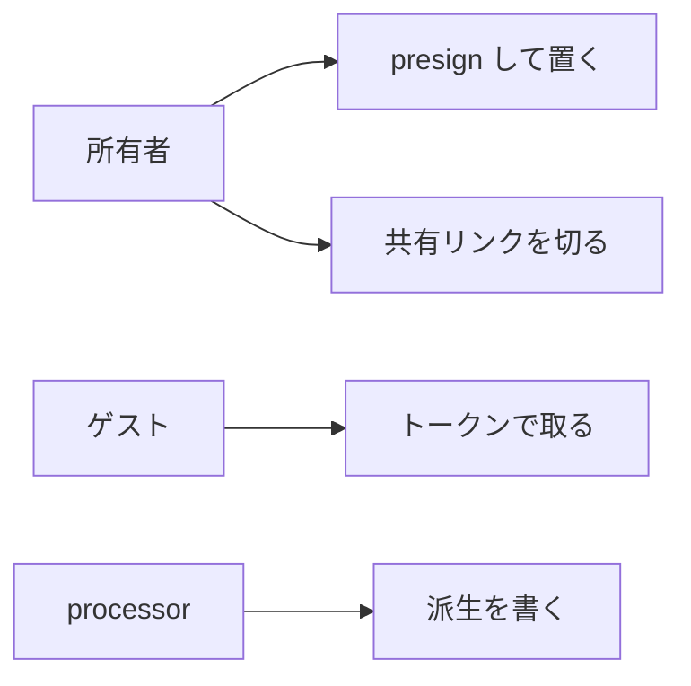
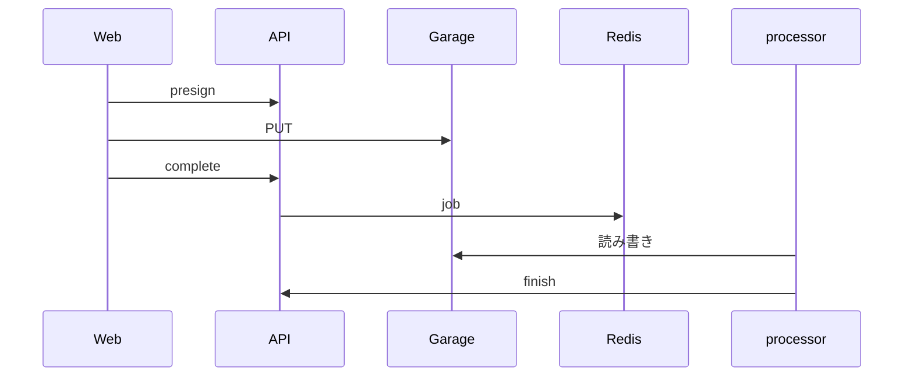

# P03 図表

| 項目 | 値 |
| --- | --- |
| プロジェクト | P03 media-platform |
| 対象スライス | アップロード〜派生。Lambda は計画 |
| 最終更新 | 2026-08-19 |
| 矛盾時の正 | 自動テストと製品コード、次に `DESIGN.md` |
| 記法 | Mermaid |

```mermaid
flowchart LR
  U[所有者] --> UC1[presign して置く]
  U --> UC2[共有リンクを切る]
  G[ゲスト] --> UC3[トークンで取る]
  P[processor] --> UC4[派生を書く]
```

```mermaid
sequenceDiagram
  participant W as Web
  participant A as API
  participant G as Garage
  participant R as Redis
  participant Pr as processor
  W->>A: presign
  W->>G: PUT
  W->>A: complete
  A->>R: job
  Pr->>G: 読み書き
  Pr->>A: finish
```
