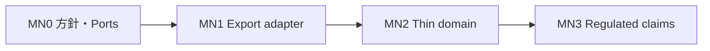

# MN — 給与・税務／バックオフィス方針

| 項目 | 値 |
| --- | --- |
| マイルストーン | **MN**（commercial-roadmap。M3 の次） |
| 製品 ID | **P16** `payroll-platform`（予約。未実装） |
| 最終更新 | 2026-08-21 |
| 実装との関係 | MN1 コードは `../pf-payroll`。方針は本書と [DESIGN.md](./payroll-platform/DESIGN.md) |

## 結論（判断）

| 問い | 判断 |
| --- | --- |
| 新規 Pxx を作るか | **作る（P16 を予約）**。今すぐ空の `pf-*` や空 `docs/` は作らない |
| P09 Attendance に載せるか | **載せない**。P09 DESIGN は給与・年末調整を非目標。労基名乗りもしない |
| P14 personal-finance に載せるか | **載せない**。個人家計であり法人給与・税務ではない |
| フル自前 ERP／給与エンジンを先に書くか | **書かない**。まず **Attendance 集計エクスポート + AccountingPort / PayrollExportPort** |
| カタログに「給与できます」と書くか | **MN ゲート Go まで書かない**（現状どおり対象外） |

理由（overview の統合基準に照らす）:

1. **アクターが違う** — 従業員打刻（P09）≠ 給与計算担当／税理士フロー（P16）≠ 個人家計（P14）
2. **一貫性境界が違う** — 分単位の勤怠イベント vs 円・控除・法定帳票 vs 家計カテゴリ
3. **物語** — 「勤怠の延長で給与」は責任範囲が爆発し、既存の「名乗らない」契約を壊す
4. **元アイデア 01–30 に給与税務は無い** — 商用ロードマップ由来の **第 16 製品** として明示するのが正しい

## スコープ段階（実装するとき）

### MN0 — 方針と契約（本スライスで完了扱い）

- [x] 本ファイル + P16 `DESIGN.md`（非目標・Ports・依存を固定）
- [x] カタログ／roadmap からリンク
- [ ] 顧客向け一文: 「給与・税務は第 N 弾。当面は既存 SaaS＋エクスポート」

### MN1 — 連携アダプタ（最初のコード）

- [x] P09 月次 CSV（`minutes-v1`、金額なし）+ 契約ヘッダ
- [x] `PayrollExportPort` + モックアダプタ（`pf-payroll`）
- [x] `AccountingPort` + モック（分数量 DTO）
- [x] `PAYROLL_ENV` staging で DEV_AUTH 拒否（単体）
- [ ] staging overlay / バックアップ手順テンプレ
- **名乗らない**: 源泉・社保・振込確定、法令準拠

### MN2 — 薄いドメイン

- [x] デモ従業員レート（`demoYenPerHour`。税率表・実賃金ではない）
- [x] 明細プレビュー UI（`GET /`、免責バナー常時）
- [x] `GET /v1/statements/preview`
- Collab／Attendance からの導線はリンクのみ（データ正本は P16）

### MN3 — 規制を名乗るときだけ

- 税理士／社労士レビュー、監査証跡、保持期間、テナント隔離の強化
- 源泉・年末調整・振込データを **名乗る** のはこのゲート **Go のあと**
- 失敗したらカタログを対象外に戻し、MN2 までに落とす

## 依存

| 依存 | 関係 |
| --- | --- |
| P01 | OIDC / org。BYO IdP 可 |
| P09 | 勤怠・工数の **入力ソース**（正本は勤怠。給与額は P16 または外部） |
| P03 | 添付（源泉票 PDF 等）は任意 |
| P13 | 分析用エクスポートの受け皿候補。P09/P16 の本番を偽ソースにしない |
| P14 | **依存しない**（混同禁止） |

## 非目標（当面〜MN2）

- 日本の給与計算エンジンの完全内製を「準拠」と名乗ること
- 電子申告（e-Tax）本線、マイナンバー本保管
- 法人会計 ERP・固定資産・本格経費精算スイート
- P09 への金額カラム追加
- 評価 LICENSE のまま実在従業員の給与本番運用

## ゲート（production-definition の拡張）

Collab ゲートに加え、MN3 で名乗るときだけ:

- 法令・専門家レビュー記録
- 計算根拠の監査ログ（誰が・どの版のルールで）
- テナント隔離とバックアップ実演
- BYO 会計／給与 SaaS の接続手順（ラボはモック）

## リポジトリ方針（コード着手時）

| 項目 | 値 |
| --- | --- |
| メタ | `portfolio-plan/payroll-platform/`（DESIGN + 後から docs） |
| 製品 | `../pf-payroll`（モノレポ想定: `apps/api`, 任意 `apps/web`） |
| 登録 | `product-repos.json` に `pf-payroll` 登録済み。着手後は workspace 同期 |
| 今やらない | 空の `docs/` 先行、法令準拠の名乗り |

## 関連

- [commercial-roadmap.md](./commercial-roadmap.md)
- [package-catalog.md](./package-catalog.md)
- [portability.md](./portability.md)
- [payroll-platform/DESIGN.md](./payroll-platform/DESIGN.md)
- [attendance/DESIGN.md](./attendance/DESIGN.md)（給与は非目標）
