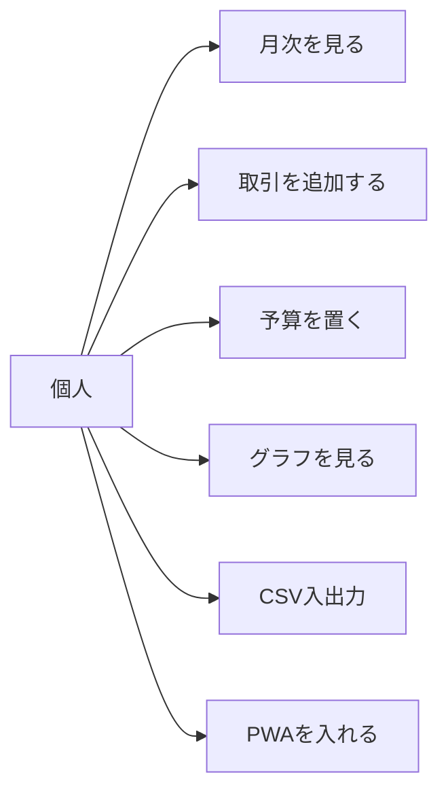
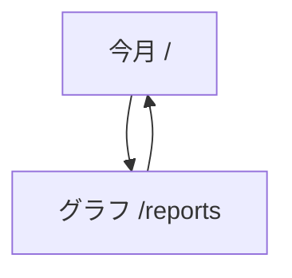
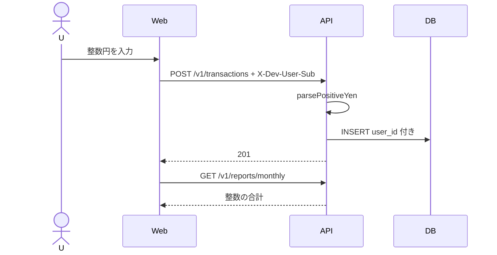
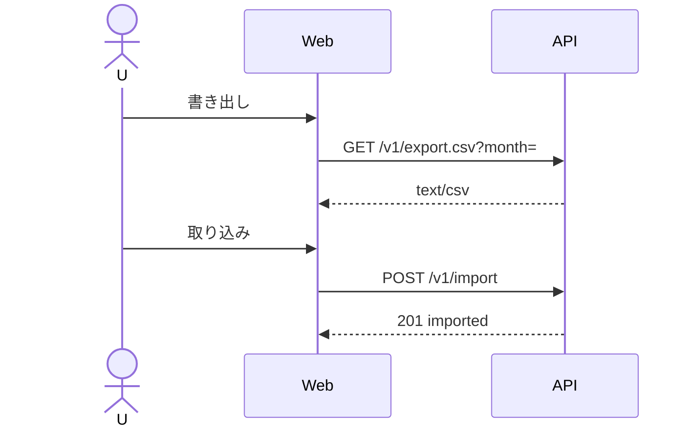
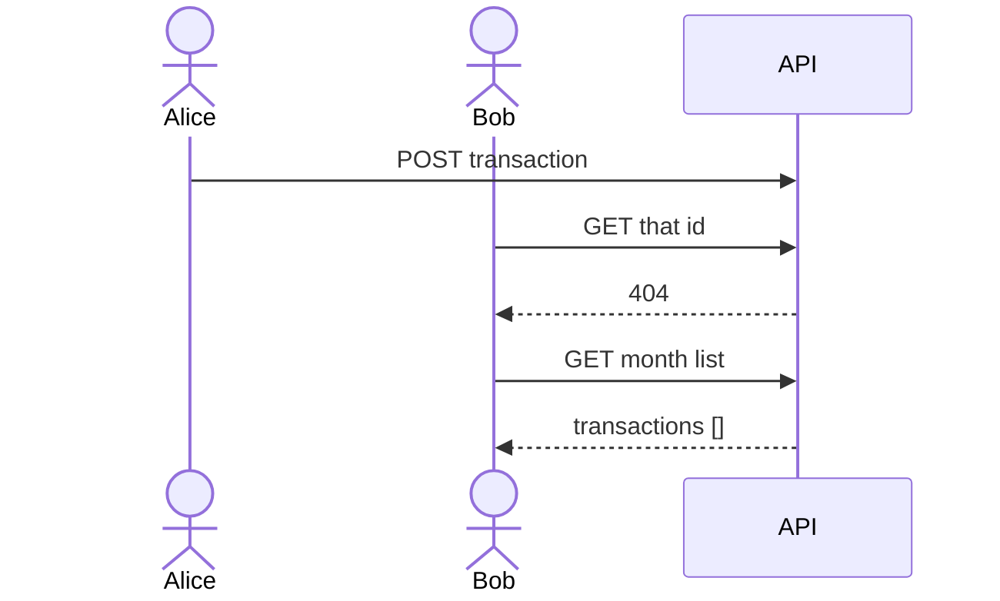
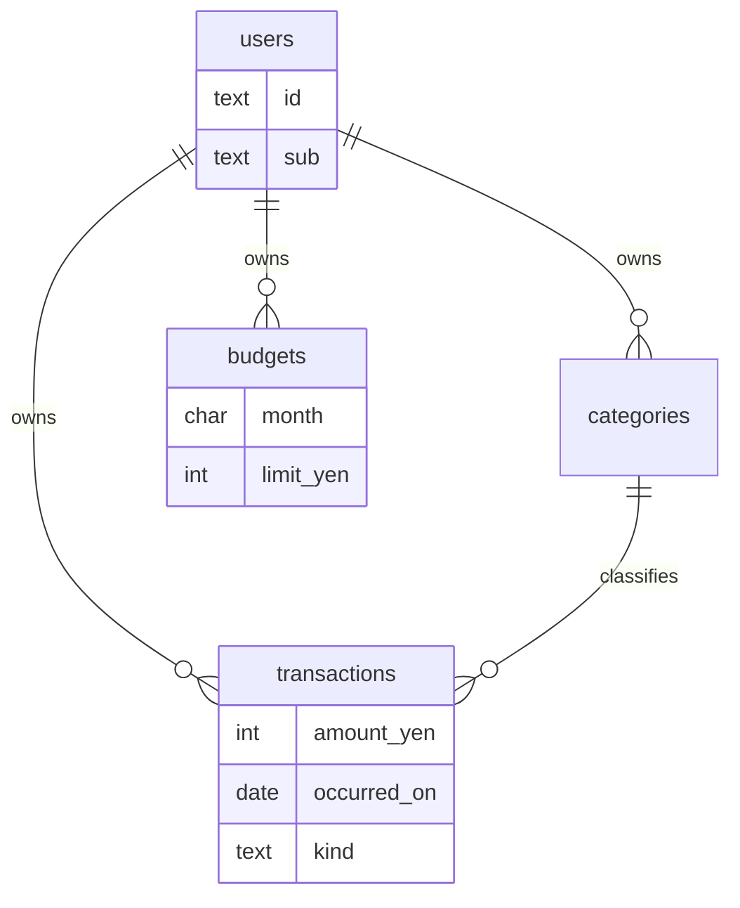

# 図表

| 項目 | 値 |
| --- | --- |
| プロダクト | personal-finance（GitHub: [pf-finance](https://github.com/maeplego/pf-finance)） |
| 最終更新 | 2026-08-19 |
| 実装との関係 | この文書と実装が違うときは、製品リポジトリのコードとテストを優先する |
| 記法 | Mermaid |

## 1. ユースケース

## 2. 画面遷移

CSV 操作はホーム上。起動の正は Compose。Kubernetes は ops overlay 経由。

## 3. 取引追加

## 4. CSV

## 5. 認可

## 6. ER（論理）

