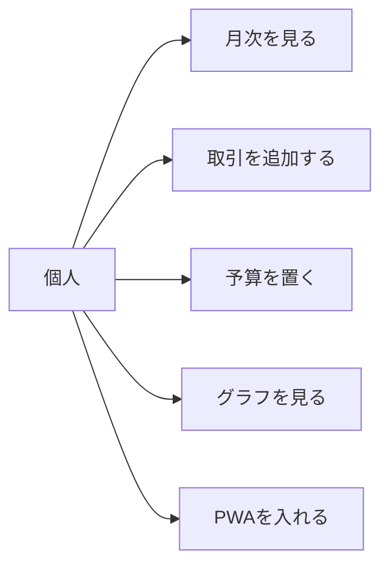
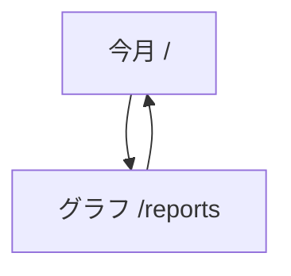
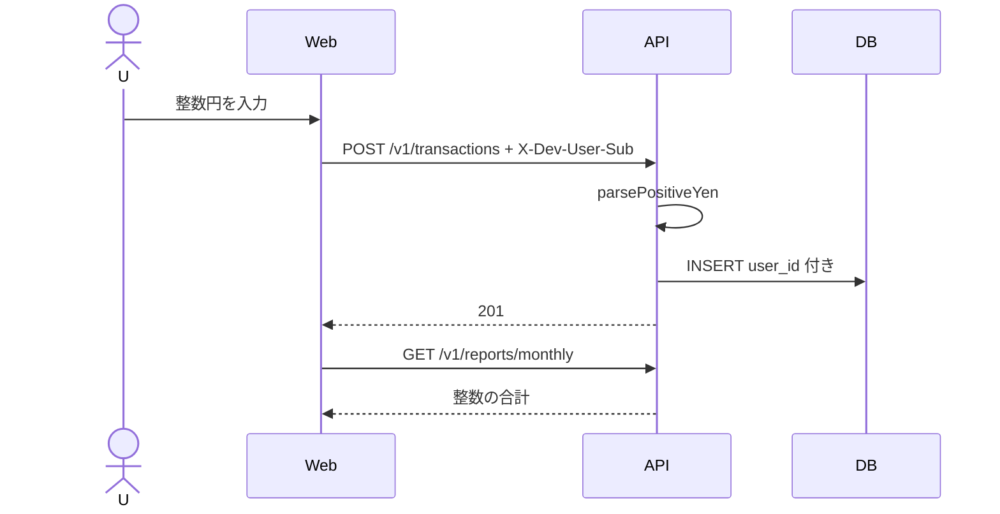
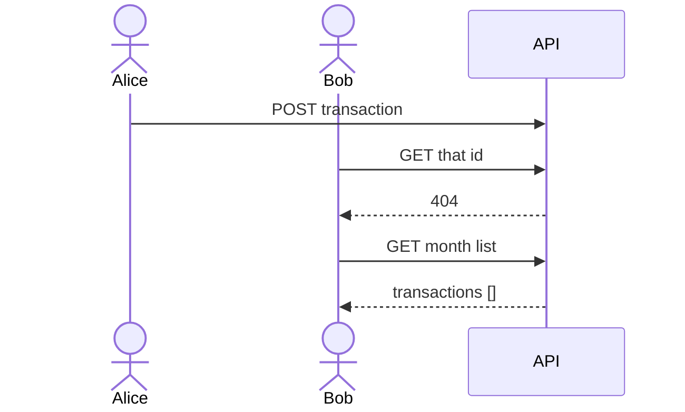
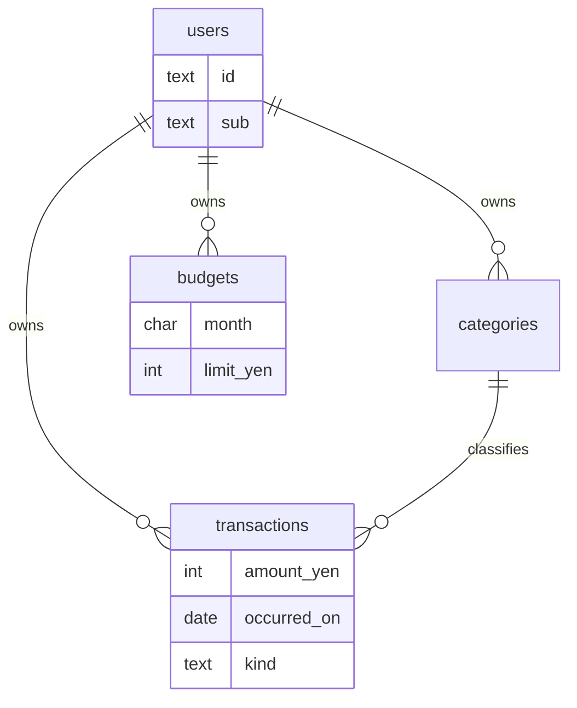

# P14 図表

| 項目 | 値 |
| --- | --- |
| プロジェクト | P14 personal-finance |
| 対象スライス | スライス 1 |
| 最終更新 | 2026-08-19 |
| 矛盾時の正 | 自動テストと製品コード、次に `DESIGN.md` |
| 記法 | Mermaid |

## 1. ユースケース

## 2. 画面遷移

## 3. 取引追加

## 4. 認可

## 5. ER（論理）

