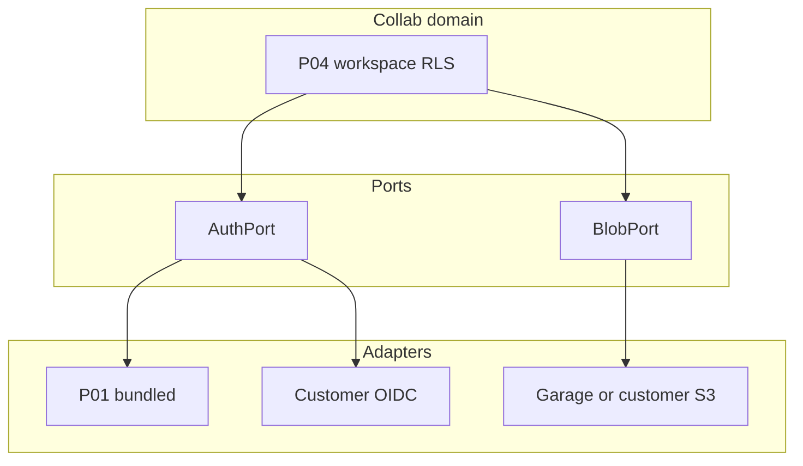

# ポータビリティ（ロックイン回避）

| 項目 | 値 |
| --- | --- |
| 対象 | パッケージ境界の差し替え可能依存 |
| 最終更新 | 2026-08-21 |

顧客が「IdP は自社 Entra」「オブジェクトは自社 S3」と望むのは自然である。全面ヘキサゴナル書き換えは商用最小の条件にしない。**標準プロトコルをポートにし、薄いアダプタで差し替える。**

対外説明: ports & adapters／BYO（Bring Your Own）。内部メモでヘキサゴナルと言ってよい。

## 原則

1. アプリのドメインは **P01 実装や特定クラウド SDK に直接依存しない**（設定とポート経由）
2. 差し替え需要が高い境界だけポート化する
3. サポート範囲をカタログに明示する（未対応プロトコルは Enterprise 別見積）

## ポート一覧（Collab 時点）

### AuthPort（必須・最優先）

| 項目 | 契約 |
| --- | --- |
| プロトコル | OIDC（authorization code + PKCE） |
| 必須クレーム | `sub` |
| テナント | `org_id`、または顧客クレーム → 設定マッピング |
| アダプタ A | 同梱 P01 Identity |
| アダプタ B | 顧客 IdP（Entra ID、Auth0、Keycloak 等） |
| 非サポート（当面） | SAML のみ、独自 proprietary SSO のみ |

**BYO 手順の要件（staging で再現）**: issuer、client_id、redirect URI、JWKS、クレームマッピング表。P04 の P01 固有 API へのハード依存は棚卸しし、汎用 OIDC に寄せる（実装は commercial-roadmap Phase 1–2）。

### BlobPort

| 項目 | 契約 |
| --- | --- |
| プロトコル | S3 互換 API |
| アダプタ | Garage（デモ）、AWS S3／互換（顧客バケット） |
| 成果 | エンドポイント・バケット・資格情報の外部化 |

### 将来ポート（第 3 弾以降・第 N 弾）

| ポート | 用途 | 目安 |
| --- | --- | --- |
| NotifyPort | メール／Webhook 通知 | Commerce／Collab 拡張 |
| PaymentPort | 決済 | Commerce 商用化時 |
| PayrollExportPort / AccountingPort | 給与・仕訳連携 | **MN / P16**（[mn-payroll-tax.md](./mn-payroll-tax.md)。当面カタログ対象外） |

## サポート境界の言い方（提案用）

- 「Collab は御社 IdP（OIDC）に接続できます。同梱 IdP は必須ではありません」
- 「ファイルは S3 互換の御社バケットを指せます」
- 「給与・税務エンジンの内製は第 N 弾。当面は既存給与／会計 SaaS へのエクスポート連携を推奨します」

## 関連

- [package-catalog.md](./package-catalog.md)
- [production-definition.md](./production-definition.md)
- [commercial-roadmap.md](./commercial-roadmap.md)
- [collab-staging.md](./collab-staging.md)
- [portability-byo-idp.md](./portability-byo-idp.md)
