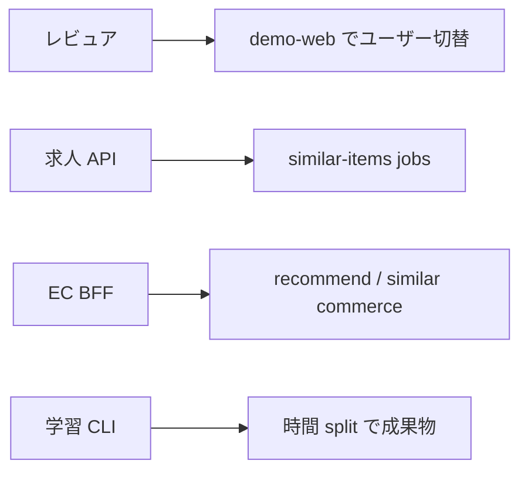
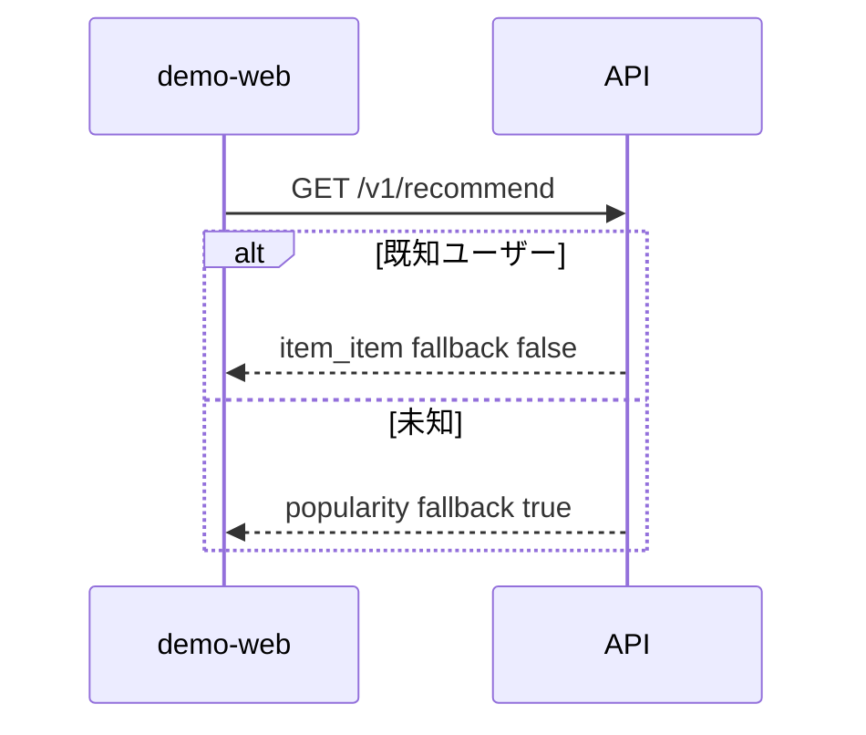
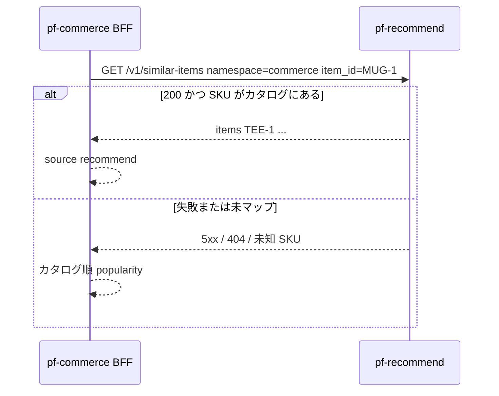

# 図表

| 項目 | 値 |
| --- | --- |
| プロダクト | 推薦エンジン（GitHub: `pf-recommend`） |
| 最終更新 | 2026-08-19 |
| 実装との関係 | この文書と実装が違うときは、製品リポジトリのコードとテストを優先する |

記法は Mermaid。

## 1. 目的

バッチ学習 → ファイル成果物 → 推論、および EC BFF の fail-closed を図示する。

## 2. 含む / 含まない

含む: 現行の CLI・API・demo-web・EC 結合。含まない: 未実装の求人 Web シェルやオンライン学習。

## 3. ユースケース

## 4. 推論（コールドスタート）

## 5. EC BFF との関係

## 6. 受け入れ

図のパス名と namespace が API 仕様・テストと一致していること。
