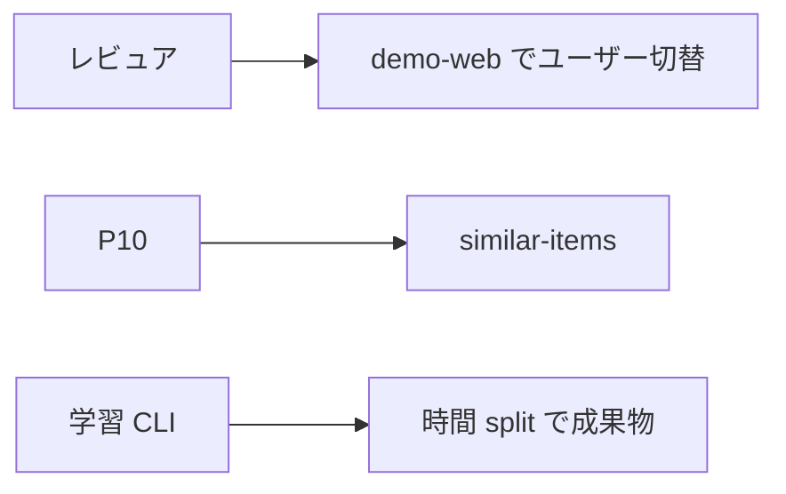
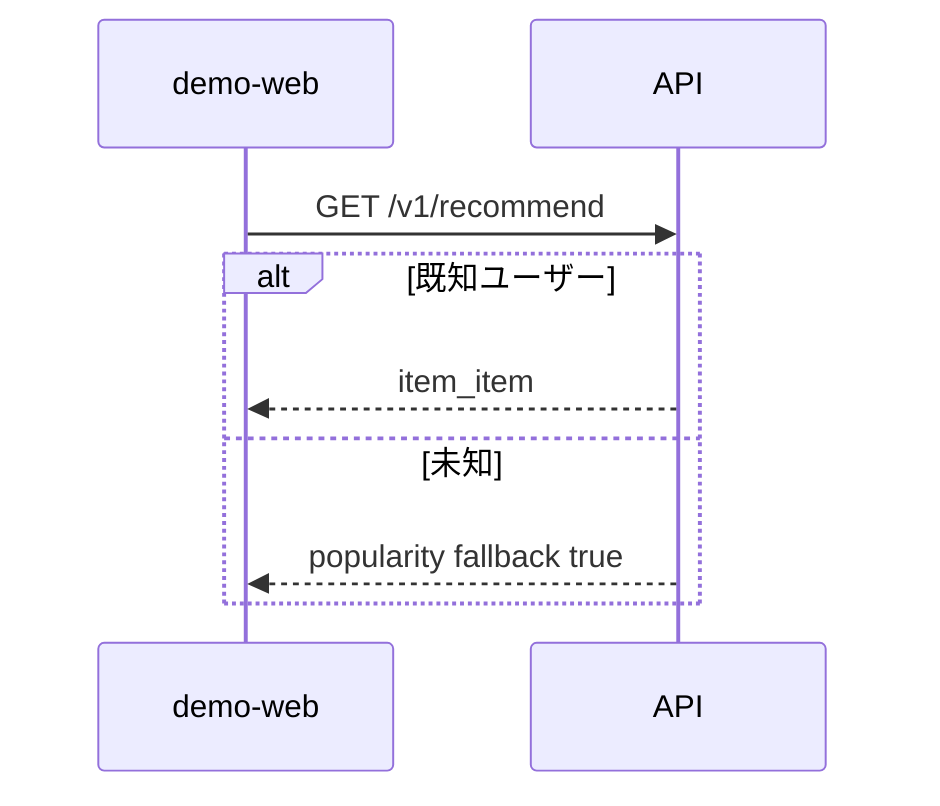

# P07 図表

| 項目 | 値 |
| --- | --- |
| プロジェクト | P07 recommend |
| 対象スライス | バッチ学習 → 推論。P06 結合は計画 |
| 最終更新 | 2026-08-19 |
| 矛盾時の正 | 自動テストと製品コード、次に `DESIGN.md` |
| 記法 | Mermaid |

```mermaid
flowchart LR
  Rev[レビュア] --> UC1[demo-web でユーザー切替]
  P10[P10] --> UC2[similar-items]
  Train[学習 CLI] --> UC3[時間 split で成果物]
```

```mermaid
sequenceDiagram
  participant W as demo-web
  participant A as API
  W->>A: GET /v1/recommend
  alt 既知ユーザー
    A-->>W: item_item
  else 未知
    A-->>W: popularity fallback true
  end
```
