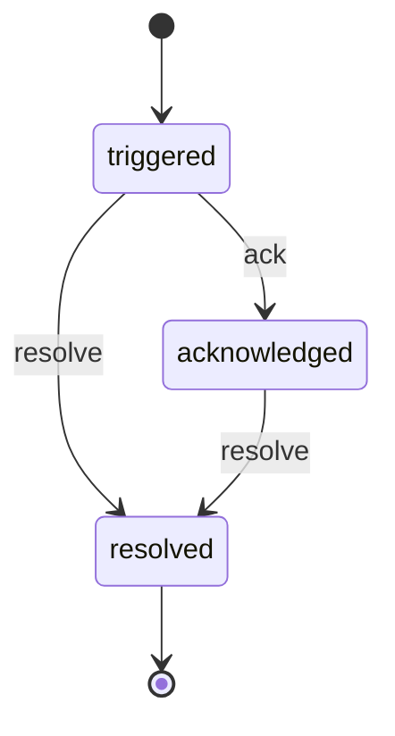
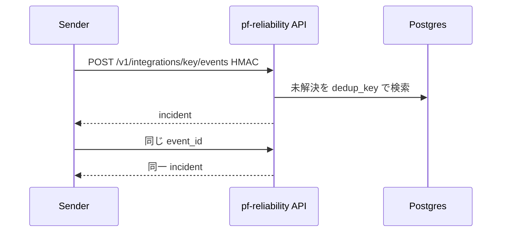
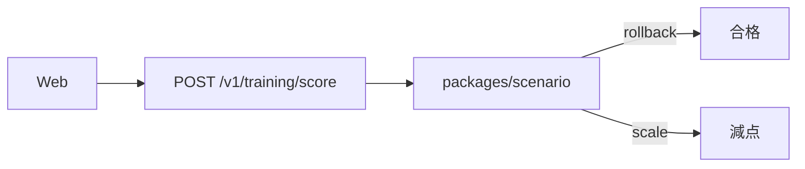

# 図表

| 項目 | 値 |
| --- | --- |
| プロダクト | reliability-platform（GitHub: [pf-reliability](https://github.com/maeplego/pf-reliability)） |
| 最終更新 | 2026-08-19 |
| 実装との関係 | この文書と実装が違うときは、製品リポジトリのコードとテストを優先する |
| 記法 | Mermaid |

## インシデント状態

## Webhook の再送と集約

## 訓練採点（クラスタ操作なし）

訓練 UI の本編と履歴は計画。状態機械と採点 HTTP は実装済み。
