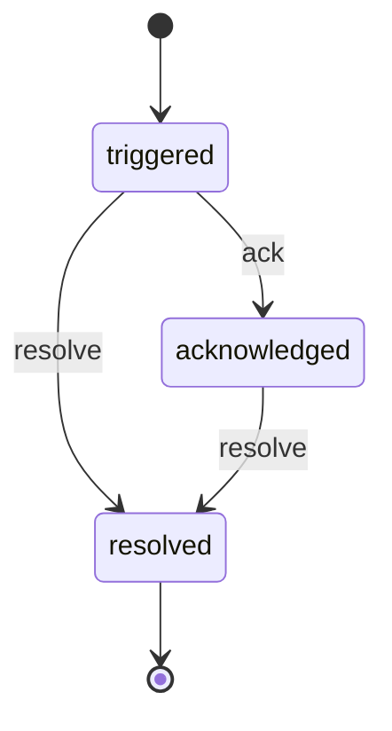
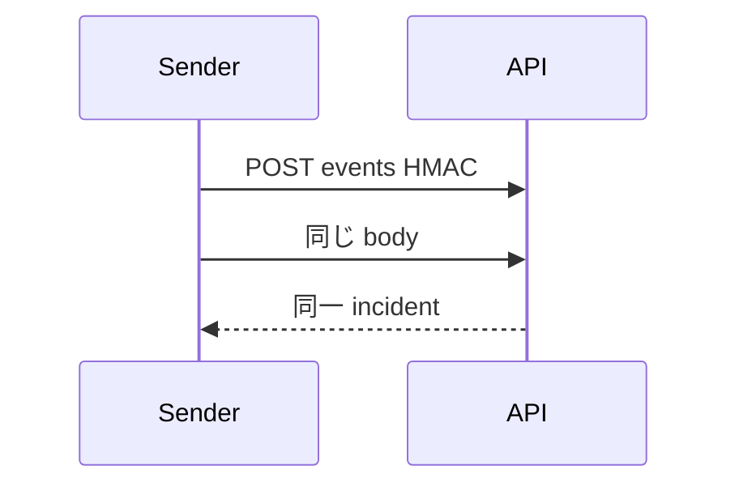

# P12 図表

| 項目 | 値 |
| --- | --- |
| プロジェクト | P12 reliability-platform |
| 対象スライス | 状態は実装済み。訓練 UI 本編は計画 |
| 最終更新 | 2026-08-19 |
| 矛盾時の正 | 自動テストと製品コード、次に `DESIGN.md` |
| 記法 | Mermaid |

```mermaid
stateDiagram-v2
  [*] --> triggered
  triggered --> acknowledged: ack
  triggered --> resolved: resolve
  acknowledged --> resolved: resolve
  resolved --> [*]
```

```mermaid
sequenceDiagram
  participant S as Sender
  participant A as API
  S->>A: POST events HMAC
  S->>A: 同じ body
  A-->>S: 同一 incident
```
