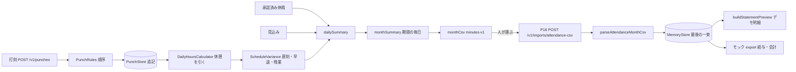

# 口の洗い出し — 入力と出力（下書き）

| 項目 | 値 |
| --- | --- |
| 状態 | 下書き（手番 0001） |
| 読んだ版 | `pf-attendance` 6d1e8ac（2026-08-21）・`pf-payroll` a851e71（2026-08-21）・`portfolio-plan` 2ccfe11 |
| 最終更新 | 2026-10-08 |
| 道 | P09 は `apps/api/src/main/java/com/pf/attendance/` からの相対。P16 は `src/` からの相対 |

印: 【測】= この手番で動かして測った。【読】= コードを読んだだけ。

## 流れ

## 1. 入口（P09）

| 口 | HTTP | コード | 効くこと |
| --- | --- | --- | --- |
| 打刻（その場） | `POST /v1/punches` `{type}` | `api/PunchController.java:31-43` → `app/AttendanceService.java:82-114` | 時刻はサーバー時計（`:87`、`:104-106`）。勤務日は打刻時刻の東京の暦日（`domain/WorkDates.java:16-18`） |
| 事後打刻 | `POST /v1/punches` `{type, workDate, at?}` | 同 `:94-107` | `at` を省くと所定の時刻（`:95-103`）。`source=manual`（`:110`） |
| 一日まとめ | `POST /v1/me/days/{date}/apply-schedule` | `api/PunchController.java:45-52` → `AttendanceService.java:117-136` | 打刻の無い日に出・休・退を入れる |
| 申請 | `POST /v1/requests` | `api/WorkflowController.java:37-45` → `AttendanceService.java:233-259` | 種類は `leave`・`punch_correction`。休暇の区分は `app/LeaveKind.java:12-27` |
| 承認・却下 | `POST /v1/requests/{id}/decision` | `api/WorkflowController.java:59-64` → `AttendanceService.java:277-305` | 上長だけ（`:601-605`） |
| 工数 | `POST /v1/allocations` | `api/WorkflowController.java:66-73` → `AttendanceService.java:307-325` | 合計が勤務分を超えると 400（`:317-321`） |
| 締め | `POST /v1/months/{month}/close` | `api/WorkflowController.java:82-87` → `AttendanceService.java:331-337` | 締めた期間への書き込みは 409（`:593-599`） |
| 見込み | `PUT /v1/me/provisional-days` | `api/ProvisionalController.java:26` → `AttendanceService.java:408-434` | `closeByDay` より後の日だけ |
| 期間・所定の設定 | `GET/PUT /v1/org/period-settings` | `api/OrgSettingsController.java:29-35` → `app/OrgPeriodSettings.java:10-59` | 既定は暦月・09:00–18:00・休憩 60 分・minutes-v1（`:46-59`） |
| 受け渡しの取り込み | `POST /v1/months/{month}/handoffs` | `api/HandoffController.java:41` → `AttendanceService.java:477-499` | 打刻は作らない（`:476`） |

入口の外から効くもの:

| もの | コード | 台帳への効き |
| --- | --- | --- |
| 時計 | `config/AttendanceConfig.java:18-21`（`Clock.systemUTC()`） | 台帳では固定が要る。既存の HTTP 試験は試験側で `MutableClock` に差し替えている（`src/test/.../api/PunchHttpTest.java` の `ClockConfig`） |
| ID | `app/Ids.java:8-10`（ULID。毎回ちがう） | 打刻・申請・工数の `id` は台帳から外す |
| 従業員の種 | `config/DemoSeed.java:26-39`・`app/DemoEmployees.java:25-55` | org-demo-a は 10 名（employed 8・client_site 2）。ID は固定 |

## 2. 中（P09 の計算）

| 段 | コード | 今の姿 |
| --- | --- | --- |
| 打刻の順序 | `domain/PunchRules.java:25-49` | 一日一回の日勤の状態機械。夜勤は無い（`:6-9`） |
| 並べ方 | `domain/PunchRules.java:51-55` | 時刻順。同じ時刻は `id`（乱数）順 |
| 日ごとの分 | `domain/DailyHoursCalculator.java:20-77` | 休憩を引く。秒は日で合計してから分に切り捨て（`:73-74` → `domain/Minutes.java:20-25`） |
| 開いたままの区間 | `DailyHoursCalculator.java:62-69`・`AttendanceService.java:143` | 「今日」だけ今の時刻まで数える。過ぎた日は数えない |
| 遅刻・早退・残業 | `domain/ScheduleVariance.java:12-37` | 残業 = 勤務分 − 所定の正味（`:35`）。法定ではなく所定との差 |
| 休暇の分 | `AttendanceService.java:148-153`・`:169-184` | 承認済み休暇を `findFirst`。有給 = 所定の正味、半休 = 半分、欠勤 = 0 |
| 打刻と休暇が同じ日 | `AttendanceService.java:155-167` | 打刻が勝つ。`leaveKind` だけ付く |
| 見込み | `AttendanceService.java:186-200` | 打刻も休暇も無い日だけ |
| 月 | `AttendanceService.java:214-226`・`domain/AttendancePeriods.java:20-45` | 期間の初日から末日まで毎日一行 |

## 3. 出口（P09）

| 口 | HTTP | コード | 形 |
| --- | --- | --- | --- |
| 日ごと | `GET /v1/me/daily-summary` | `api/DailySummaryController.java:30-51` | JSON。打刻の `id` を含む |
| 月 | `GET /v1/me/month-summary` | `api/MonthSummaryController.java:27-52` | JSON。日ごとに分・状態・遅刻・早退・残業 |
| 月の CSV | `GET /v1/months/{month}/export.csv` | `api/WorkflowController.java:89-111` → `AttendanceService.java:347-387` → `app/export/CsvExporter.java:12-47` | 下の表 |
| freee 形式 | 同 `?profile=freee-hr-monthly-v1` | `app/export/VendorCsvFormats.java:79-146` | 所定・法定内残業・時間外・深夜・法定休日の 5 列（`:126-130`）と、所定休日出勤日数・法定休日出勤日数（`:134-135`）は "0" 固定 |
| MF 形式 | 同 `?profile=mf-attendance-punch-v1` | `VendorCsvFormats.java:44-72` | 打刻一つに一行 |
| erp-generic-ja・custom | 同 | `app/export/CsvExportProfiles.java:27-58` | 列の選び替え |
| PDF | `GET /v1/months/{month}/timesheet.pdf` | `api/WorkflowController.java:113-124` → `app/export/PdfTimesheetRenderer.java:21-82` | Helvetica（`:46-47`） |
| 受け渡し CSV | `GET /v1/months/{month}/handoff.csv` | `api/HandoffController.java:30` → `AttendanceService.java:450-474` | client_site だけ。見出しは `app/handoff/HandoffCsv.java:8-9` |
| 未打刻 | `GET /v1/reminders/unpunched` | `api/WorkflowController.java:126-144` → `AttendanceService.java:436-444` | JSON |
| 拒否 | — | `api/ApiExceptionHandler.java:17-45` | 409 `conflict`・409 `period_closed`・403・401・400 |

minutes-v1（P16 への契約）:

| 項目 | 今の姿 | コード |
| --- | --- | --- |
| 列 | `sub,displayName,workDate,workMinutes,breakMinutes,status,engagement,worksiteCode,worksiteName` | `CsvExportProfiles.java:10-24` |
| 行の順 | 社員は `findAllByOrgId` の順 × 日付順。社員の順は並べていない（`ConcurrentHashMap` の順） | `AttendanceService.java:383-385`・`app/MemoryEmployeeStore.java:30-38` |
| status | enum 名を小文字に（ロケール指定なし） | `CsvExporter.java:41` |
| 改行 | LF。最後に改行一つ | `CsvExporter.java:14`・`:29` |
| 契約の印 | 応答ヘッダ `X-Attendance-Export-Contract` | `api/WorkflowController.java:108` |
| 金額 | 列なし | — |

## 4. 継ぎ目（P09 → P16）

| 項目 | 今の姿 | コード |
| --- | --- | --- |
| 運び方 | 人の手。P16 の画面に貼るか、POST する | `pf-payroll/README.md` |
| 見出しの照合 | 先頭 6 列だけ見る。後ろに列が増えても通る | `attendance-csv.ts:26` |
| 金額らしい見出し | 拒否 | `attendance-csv.ts:29-31` |
| 捨てる列 | `engagement`・`worksiteCode`・`worksiteName`。`displayName` も既定で捨てる | `attendance-csv.ts:43-52`・`config.ts:46` |
| 月の印 | CSV に無い。`?month=` を `monthHint` として持つだけ | `app.ts:47` |
| status | 持つが、計算に使わない | `statement.ts:46-48` |

## 5. P16 の入口から出口まで

| 口 | HTTP | コード | 今の姿 |
| --- | --- | --- | --- |
| 取り込み | `POST /v1/imports/attendance-csv` | `app.ts:44-70` → `attendance-csv.ts:17-56` | 応答に `id`（ULID）。`importedAt` は `new Date()` |
| 保管 | — | `store.ts:16-22` | org ごとに最後の一束だけ使う |
| デモ時給 | `GET/PUT /v1/demo-rates` | `app.ts:72-99`・`statement.ts:34-37` | aoki 1500・sato 1800。ほかは 1000（`statement.ts:51-55`） |
| 明細 | `GET /v1/statements/preview` | `app.ts:101-109` → `statement.ts:39-74` | status を見ずに分を合計（`:46-48`）。`floor((分/60) × 時給)`（`:56`）。sub の順（`:50`） |
| 給与（モック） | `POST /v1/exports/payroll` | `app.ts:111-124` → `adapters/mock-payroll-export.ts:10-21` | 受領の `id` は ULID、時刻は `new Date()` |
| 会計（モック） | `POST /v1/exports/accounting` | `app.ts:126-147` | 分の数量。円ではない（`ports/accounting.ts:1-6`） |
| 免責 | `GET /v1/disclaimer`・`GET /` | `app.ts:27-34`・`disclaimer.ts:2-3`・`ui.ts` | `legalEffect: false` |

## 6. 実測（手番 0001）

製品の写し（読むだけの clone）で測った。製品のファイルは一つも変えていない。測った台本はコミットしない。

| # | 何を | 結果 |
| --- | --- | --- |
| M1 | P09 の試験 `mvn -B -f apps/api/pom.xml test` | 42 件・失敗 0（JDK 21.0.12、Maven 3.9.11） |
| M2 | P16 の試験 `npm test` と型 `tsc --noEmit` | 試験は 12 件・失敗 0（Node 22.22.0）。型は 1 件の誤り: `ports/payroll-export.ts:1` の `./attendance-csv.js` が `src/ports/` を指す。CI は vitest だけ（`.github/workflows/ci.yml:20-23`） |
| M3 | org-demo-a の人数 | 10 名。README は「開発部 8 名」（`pf-attendance/README.md:8`） |
| M4 | 月の CSV の社員の順 | shima.rena, sato.mei, aoki.haru, fujii.an, kondo.minato, okada.ritsu, murakami.hayate, takahashi.saku, nakamura.nagi, ise.yuto。同じ JDK で 50 回とも同じ |
| M5 | 夜勤（23:00 出勤 → 翌 00:30 退勤） | 退勤は 409「clock_in is required first」。前日は `clocked_in`・0 分のまま |
| M6 | 事後打刻で既存より前の時刻（09:00 出勤のあと `break_start` at 08:00） | 受け付ける。その日の日次は 409。その org の月の CSV 全体も 409 |
| M7 | 土曜（2026-08-22）の有給を承認 | `on_leave`・480 分 |
| M8 | 同じ日に承認済み休暇が二つ（有給と欠勤） | 50 回で 有給/480 が 26 回、欠勤/0 が 24 回。揺れる |
| M9 | PDF | バイトは毎回ちがう（`/CreationDate`・`/ID`）。日本語の名前（青木 陽）は PDF の文字から消える |
| M10 | 打刻の無い月（2026-07）の minutes-v1 | 311 行（見出し + 10 名 × 31 日） |
| M11 | P16 に本物の形の行（clocked_out 480・on_leave 480・provisional 480・clocked_in 0・clocked_out 69）を通す | 1509 分をすべて数え、時給を掛ける |
| M12 | P16 の端数 | 69 分 × 1500 円/時 → 1724（整数で計算すると 1725）。0〜20000 分で、1500 円は 1362 個、1800 円は 838 個、1000 円は 46 個ずれる |
| M13 | P16 の `testdata/attendance-minutes-v1.csv` | 6 列・status は "complete"。P09 の本物は 9 列・status は `absent` などの小文字の enum 名 |
| M14 | ロケール tr_TR で minutes-v1 | `clocked_in` が `clocked_ın`（U+0131）になる。en_US では `clocked_in` |
| M15 | このコンテナの標準出力 | ASCII（`stdout.encoding=ANSI_X3.4-1968`）。CSV の中身は UTF-8 で正しい。台帳はファイルに UTF-8 で書く |
