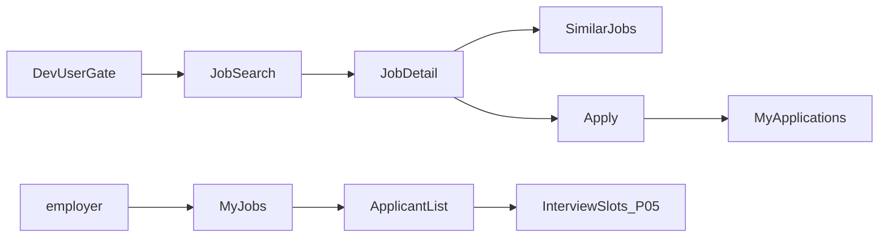
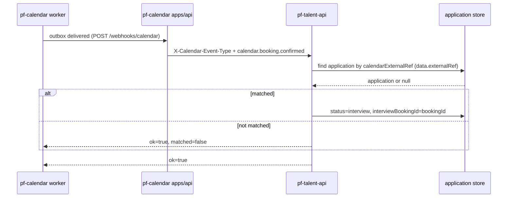
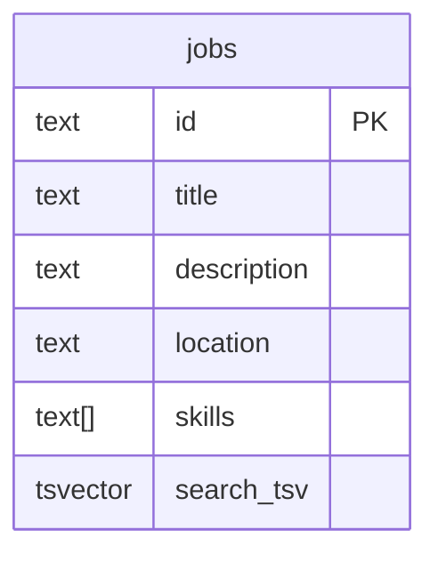

# P10 図表

| 項目 | 値 |
| --- | --- |
| プロジェクト | P10 talent-platform |
| 対象スライス | webhook 連携契約 + 検索画面 |
| 最終更新 | 2026-08-19 |
| 矛盾時の正 | 自動テストと製品コード、次に `DESIGN.md` |

## 画面遷移（実装済み: 検索 / 詳細）

ゲスト画面は無い。`?user=` 必須。同じ応募でも候補者はタイトルと自分のステータス、企業は履歴書全文と遷移操作。他社は 403。

## シーケンス（予約確定 → interview 更新）

## ER（検索まわり）

`search_tsv` は generated。GIN + `pg_trgm`。OpenSearch テーブルは無い。

