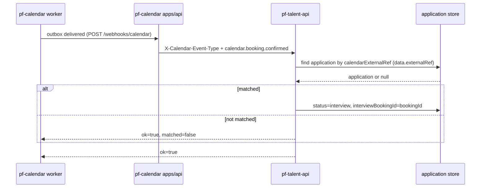

# P10 talent-platform — 図表

| 項目 | 値 |
| --- | --- |
| プロジェクト | P10 talent-platform |
| 対象スライス | webhook 連携契約 |
| 最終更新 | 2026-08-18 |

## シーケンス（予約確定 → interview 更新）

```mermaid
sequenceDiagram
  participant Worker as pf-calendar worker
  participant P05API as pf-calendar apps/api
  participant Talent as pf-talent-api
  participant Store as application store

  Worker->>P05API: outbox delivered (POST /webhooks/calendar)
  P05API->>Talent: X-Calendar-Event-Type + calendar.booking.confirmed
  Talent->>Store: find application by calendarExternalRef (data.externalRef)
  Store-->>Talent: application or null
  alt matched
    Talent->>Store: status=interview, interviewBookingId=bookingId
  else not matched
    Talent-->>Worker: ok=true, matched=false
  end
  Talent-->>Worker: ok=true
```

