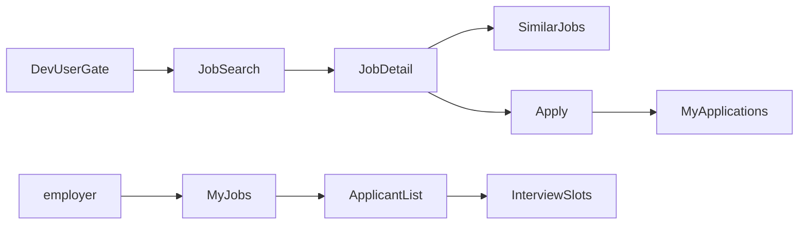
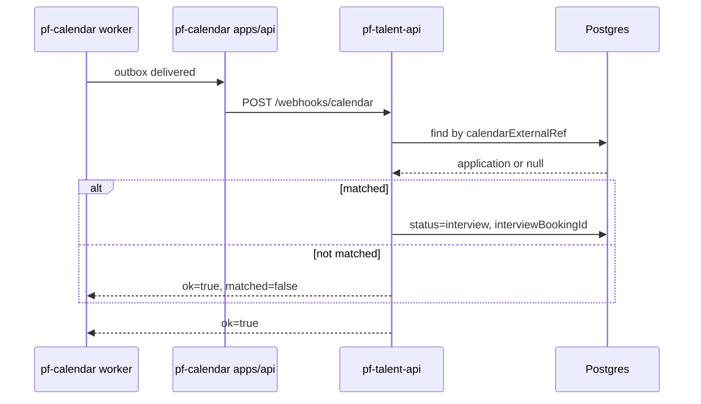
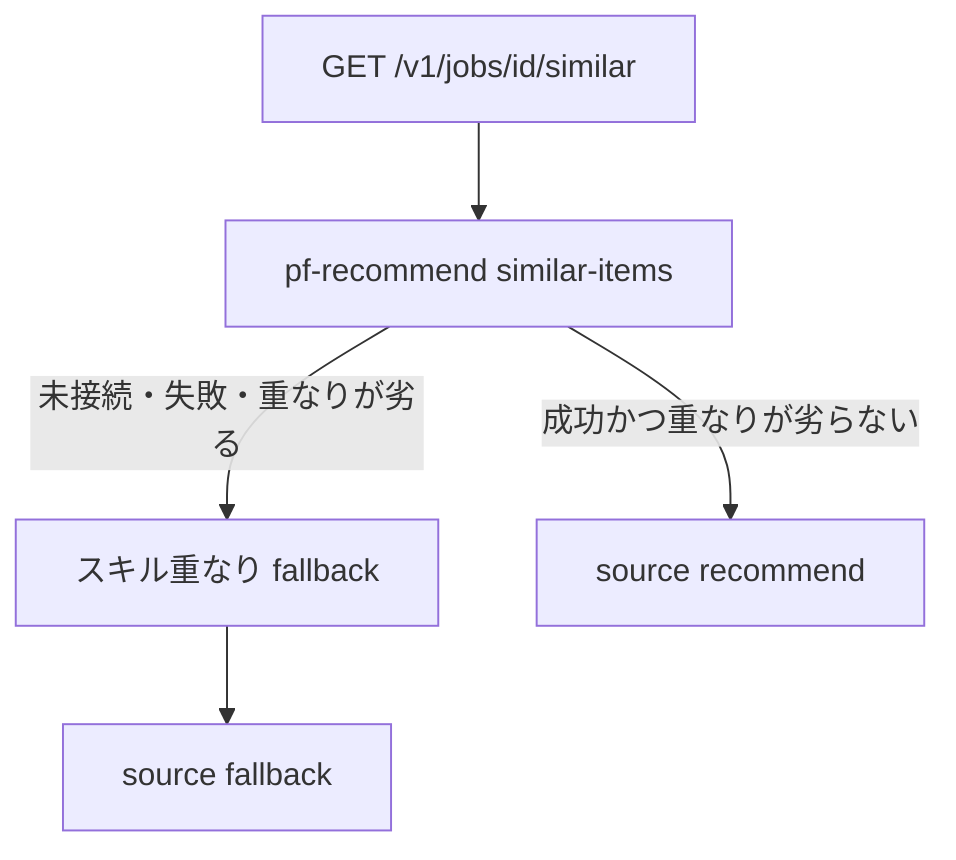
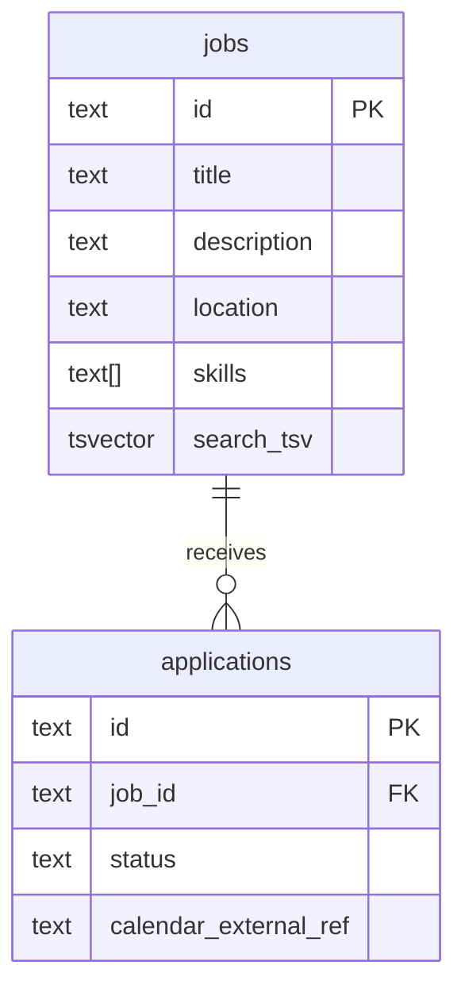

# 図表

| 項目 | 値 |
| --- | --- |
| プロダクト | talent-platform（GitHub: [pf-talent-api](https://github.com/maeplego/pf-talent-api)、[pf-talent-web](https://github.com/maeplego/pf-talent-web)） |
| 最終更新 | 2026-08-19 |
| 実装との関係 | この文書と実装が違うときは、製品リポジトリのコードとテストを優先する |
| 記法 | Mermaid |

## 画面遷移

ゲスト画面は無い。`?user=` 必須。同じ応募でも候補者はタイトルと自分のステータス、企業は履歴書全文と遷移操作。他社は 403。面接枠は [pf-calendar](https://github.com/maeplego/pf-calendar) の公開ページへ誘導する。

## 予約確定 → 応募ステータス interview

## 類似求人（閉じる）

## ER（検索まわり）

`search_tsv` は generated。GIN + `pg_trgm`。OpenSearch テーブルは無い。Compose の正は Postgres。
