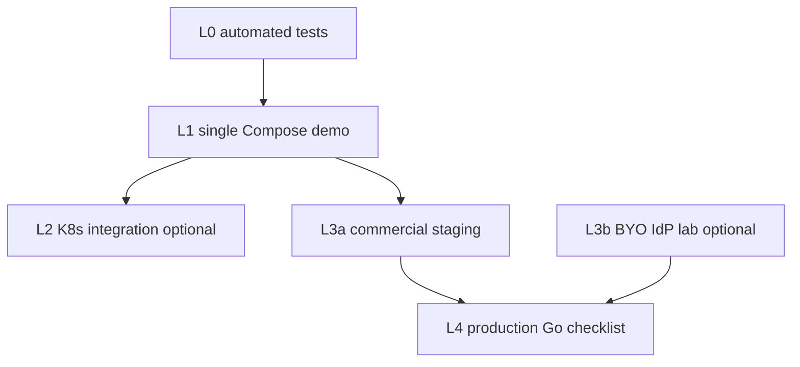

# 動作確認の地図（Verification）

| 項目 | 値 |
| --- | --- |
| 対象 | 開発者・採用レビュア・商用準備 |
| 最終更新 | 2026-08-21 |

「どの起動をすればよいか」が分からなくなったときの正本。手順の詳細は既存文書へリンクし、ここでは **層（何を保証するか）× 対象（何を見るか）** だけを固定する。

公開ソースはデモ／評価用（[licensing.md](./licensing.md)）。本番と呼ぶ条件は [production-definition.md](./production-definition.md)。

## 一目で選ぶ

| やりたいこと | 使う層 | 起動の入口 |
| --- | --- | --- |
| コードを直したあとすぐ | **L0** | 各 `pf-*` の unit / CI（[ci.md](./ci.md)） |
| 採用・自己デモ（既定） | **L1** | [REVIEW.md](./REVIEW.md)、`demo.ps1` / Compose |
| K8s・Ingress・横断を見せる | **L2**（任意） | [integration-demo.md](./integration-demo.md) overlay |
| 商用直前のゲート確認 | **L3a** | [collab-staging.md](./collab-staging.md) |
| Auth0 / Entra など顧客 IdP | **L3b**（デモ非必須） | [portability-byo-idp.md](./portability-byo-idp.md) |
| 売ってよいか判断 | **L4** | [production-definition.md](./production-definition.md) Go/No-Go |

「7 種類の独立した確認」ではなく、**L0〜L4 の層**と、その上に載る **パッケージ軸**（Collab など）で考える。

---

## 層の定義

### L0 — 自動テスト（開発者・CI）

| | |
| --- | --- |
| **誰** | 開発者。採用担当は不要 |
| **保証** | 単体・契約テストが緑。回帰の早期検知 |
| **やること** | 各 `pf-*` の `go test` / `npm test`。[ci.md](./ci.md)。Collab 例: `pf-workspace/apps/e2e`（同梱 IdP、DEV_AUTH オフ） |
| **保証しない** | UI の採用デモ体験、クラスタ配線、顧客 IdP |

### L1 — 単体デモ／レビューパック（採用・自己デモの既定）

| | |
| --- | --- |
| **誰** | 採用担当・技術レビュア・自分のデモ |
| **保証** | その製品（または薄いパック）が Compose で動く |
| **やること** | [REVIEW.md](./REVIEW.md)。各 `pf-*/deploy/compose.yaml`、または `pf-cloud-k8s` の `demo.ps1` / `review-up.ps1 -Pack p01-p03\|p04\|p06` |
| **保証しない** | 本番セキュリティ、全 Pxx 同時起動、外部 SaaS、商用 SLO |

対応する旧称: 「Compose で単独 Pxx」「開発者の手元デモ（画面付き）」の一部。

### L2 — Kubernetes 連携デモ（任意・深掘り）

| | |
| --- | --- |
| **誰** | インフラを見たいレビュア／自分 |
| **保証** | IdP → アプリ → 観測など横断が overlay で見える |
| **やること** | [integration-demo.md](./integration-demo.md)。overlay A–F、`cluster-smoke-*.ps1`。例: demo B（`docker-desktop-b-collab`）は DEV_AUTH 可の採用スモーク |
| **保証しない** | 商用 staging と同一であること（下記 L3a と混同しない） |

採用の既定経路ではない（REVIEW が Compose 既定）。

### L3a — 商用 staging

| | |
| --- | --- |
| **誰** | 商用パッケージ準備をする自分／顧客 PoC 前 |
| **保証** | DEV_AUTH オフ、OIDC+org、本番ゲートの staging 項目を満たしうる |
| **やること** | [collab-staging.md](./collab-staging.md)。`docker-desktop-b-collab-staging`（DEV_AUTH 禁止）。ゲートは [production-definition.md](./production-definition.md) |
| **保証しない** | 評価 LICENSE のまま本番利用してよいこと |
| **記録** | 2026-08-21: staging smoke **pass**（DEV_AUTH 401・OIDC redirect）。バックアップ実演 Pass → L4 自己監査 **Go（Risk Accept 付き）** |

| Overlay | 層 | DEV_AUTH |
| --- | --- | --- |
| `docker-desktop-b-collab` | L2 デモ | API で可 |
| `docker-desktop-b-collab-staging` | L3a | 禁止 |
| `docker-desktop-d-commerce` | L2 デモ | gateway/order で可 |
| `docker-desktop-d-commerce-staging` | L3a（Commerce 入口） | 禁止（[commerce-staging.md](./commerce-staging.md)）。2026-08-21 cluster smoke **pass** |

### L3b — 外部 IdP／クラウド（BYO）

| | |
| --- | --- |
| **誰** | BYO 契約の顧客 PoC。公開デモでは行わない |
| **保証** | 設定とコードパスがあること（実装済み） |
| **やること** | [portability-byo-idp.md](./portability-byo-idp.md)、`pf-workspace/deploy/byo-oidc/`（mock で経路確認可）。Auth0/Entra 実機は顧客環境 |
| **保証しない** | ポートフォリオ公開デモでの Auth0/Entra 接続実績 |

### L4 — 本番 Go（販売判断）

| | |
| --- | --- |
| **誰** | 契約・販売判断 |
| **保証** | [production-definition.md](./production-definition.md) の必須ゲートが Yes または Risk Accept 記録済み |
| **やること** | チェックリスト記入。評価 LICENSE のまま実課金運用は No-Go |
| **保証しない** | 「デモが動いた＝本番完成」 |

---

## パッケージ軸（層の上に載る）

対象は [package-catalog.md](./package-catalog.md)。層を満たす単位は「全 15 本」ではなくパッケージ。

| パッケージ | 提案・デモに最低必要な層 | メモ |
| --- | --- | --- |
| Foundation | L0 + L1 | IdP／観測の単体 |
| **Collab**（第一弾） | L0 + L1 + **L3a**（販売準備）。**L4** で契約 | L2 任意。BYO なら +L3b（顧客環境） |
| Commerce / Talent / Attendance | 各パッケージ商用化時に Collab と同様の L0+L1+L3a | 決済・労基は別ゲート |
| その他 | L0 + L1 で学習デモ | 商用は roadmap 順 |

---

## よくある混同

| 混同 | 正しい見方 |
| --- | --- |
| `demo.ps1` と staging が同じ | demo／REVIEW は L1（または L2）。staging は L3a |
| overlay B が商用 | デモ B は L2。商用は `*-staging` |
| E2E 緑＝採用デモ完了 | L0。画面デモは L1 |
| Auth0 実装済み＝接続確認済み | L3b は設定例まで。公開デモでは実接続しない |
| 全 Pxx を一度に確認 | 非目標。パッケージまたは overlay 1 本 |

---

## 商用上乗せ（動作確認以外の信頼性）

デモ品質から販売するとき、新機能より先に **同じ Collab を L3a/L4 で繰り返し証明できる仕組み** が要る。

| 領域 | 内容 | 足場 |
| --- | --- | --- |
| 品質ゲート | unit・境界・最小 E2E を CI で必須化 | [ci.md](./ci.md)、Collab e2e |
| 環境分離 | demo ≠ staging ≠ production（DEV_AUTH 禁止） | `IDENTITY_ENV` / `WORKSPACE_ENV` |
| 観測・アラート | health/ready、OTLP、最低 1 アラート、初期 SLO | pf-cloud-o11y alerts |
| 運用 | runbook、バックアップ実演、ロールバック | workspace docs 07 |
| セキュリティ | 依存スキャン、秘密を Git に置かない、監査 | ci Trivy、identity audit docs |
| 契約・サポート | 評価 vs 商用、名乗らない領域の明示 | [licensing.md](./licensing.md)、package-catalog |
| 変更管理 | trunk、小さなコミット、破壊的変更の告知 | [git-branching.md](./git-branching.md) |
| 顧客受け入れ | Go/No-Go 記録、PoC データ範囲の合意 | production-definition |

ロードマップ: [commercial-roadmap.md](./commercial-roadmap.md)。

---

## 関連

- [REVIEW.md](./REVIEW.md) — 採用向け L1 手順
- [integration-demo.md](./integration-demo.md) — L1/L2 の詳細
- [collab-staging.md](./collab-staging.md) — L3a
- [production-definition.md](./production-definition.md) — L4
- [package-catalog.md](./package-catalog.md) — パッケージ境界
- [portability.md](./portability.md) / [portability-byo-idp.md](./portability-byo-idp.md) — L3b
