# 図表

| 項目 | 値 |
| --- | --- |
| プロダクト | チーム作業場所 [pf-workspace](https://github.com/maeplego/pf-workspace) |
| 最終更新 | 2026-08-19 |
| 実装との関係 | コードと [05-api.md](05-api.md) を優先する |
| 記法 | Mermaid |

## ユースケース（現行）

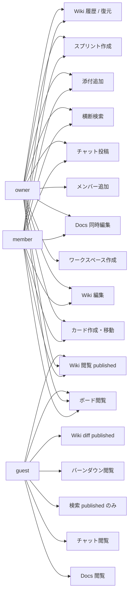

未読バッジは未実装。

## 画面遷移（実装済み）

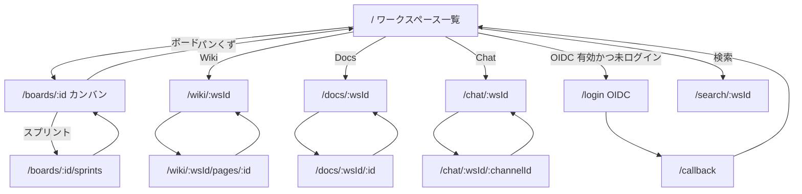

開発モードでは login を経由しない。

## シーケンス: カード移動成功

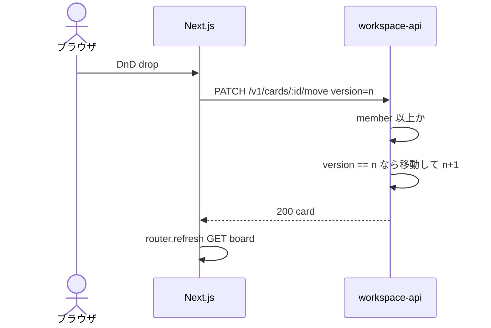

## シーケンス: version 競合

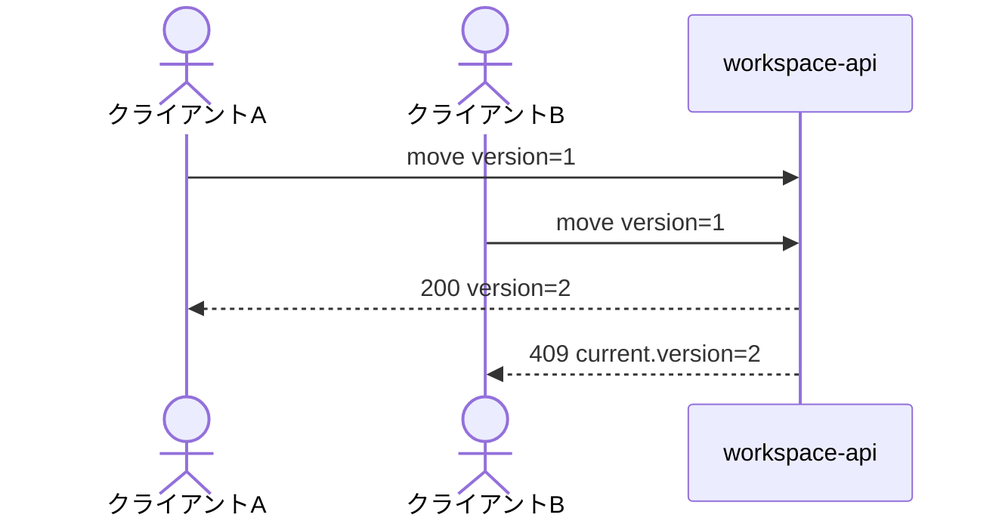

どちらが 200 かは規定しない。

## シーケンス: collab 接続

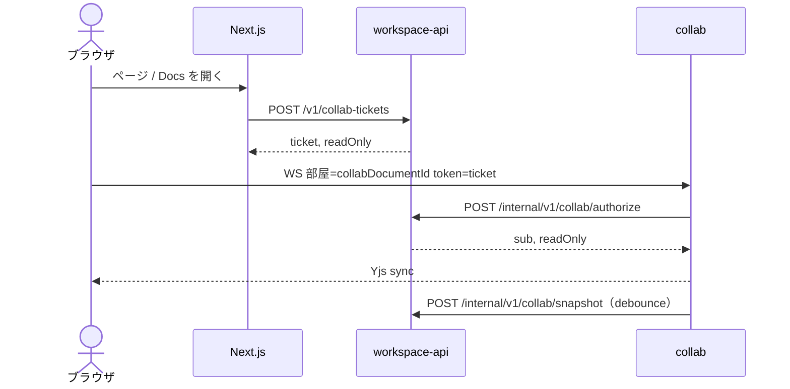

チケットと部屋が違うと authorize は 403。guest の draft はチケット自体が 404。

## シーケンス: チャット投稿

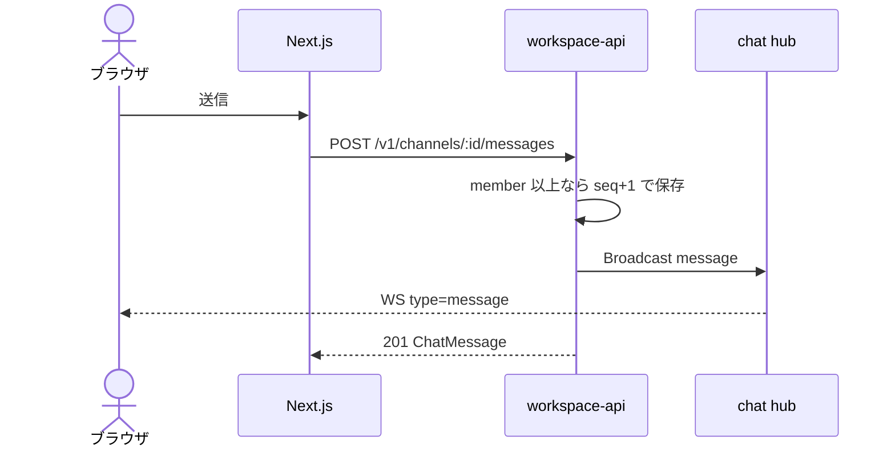

再接続は WS open のあと `GET .../messages?afterSeq=`。

## シーケンス: 横断検索（guest）

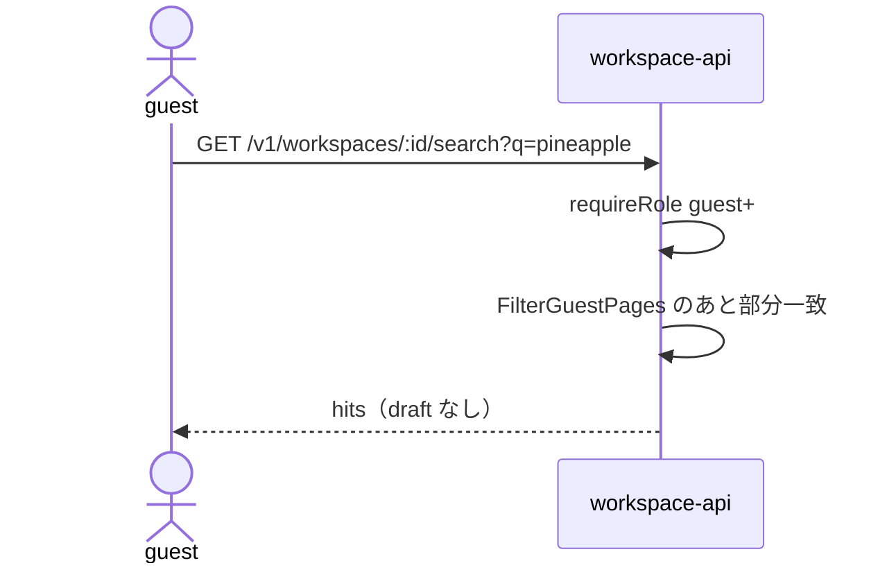

空 q は 400。非所属は 403。

## シーケンス: ローカル添付

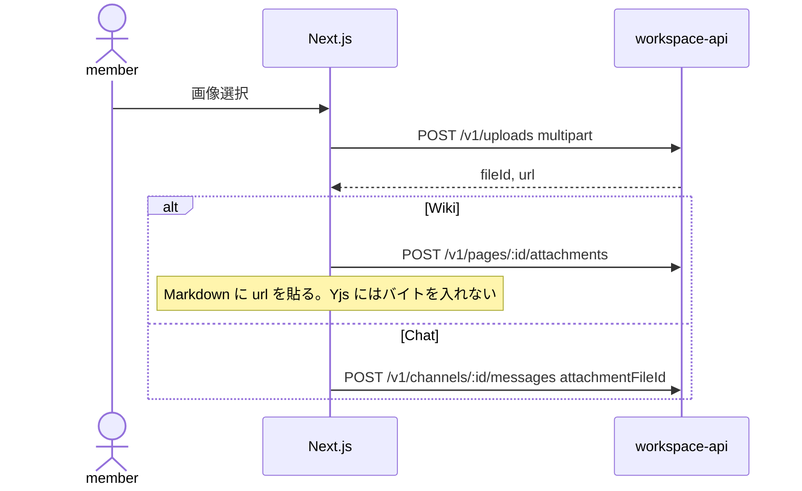

guest の upload は 403。

## シーケンス: バーンダウン

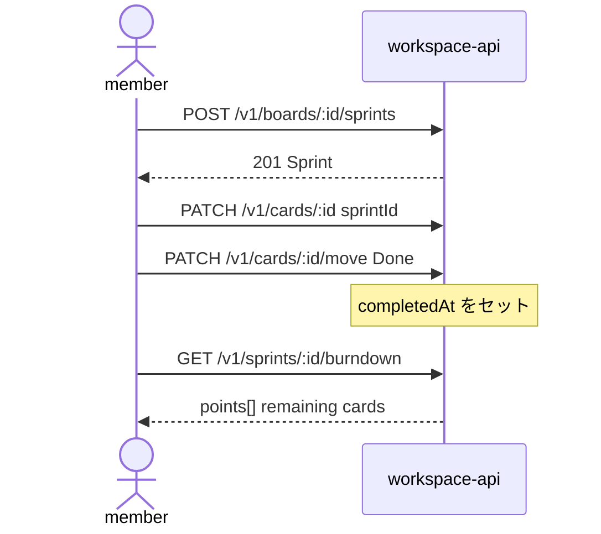

guest の作成は 403。GET は 200。

## シーケンス: Wiki 履歴 diff

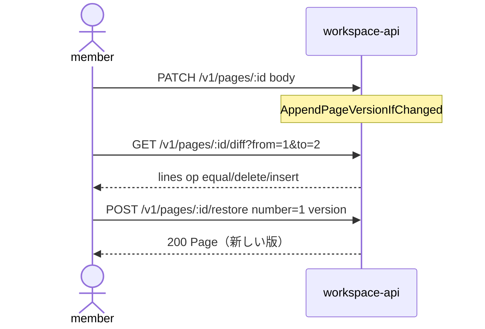

guest の draft 履歴は 404。restore は 403。

## 論理 ER

DDL は `pf-workspace/apps/api/internal/store/postgres/schema.sql`。id は ULID（TEXT）、時刻は timestamptz。

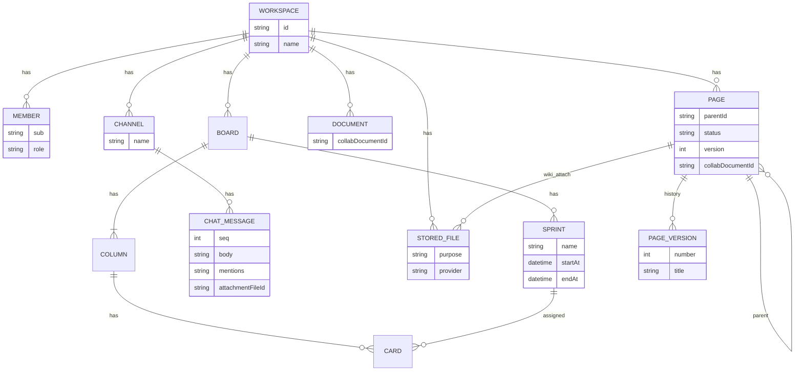
